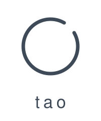

# Tao

**Local-first AI coding workflow orchestration for planning, verified slices, isolated Git worktrees, exact-diff review, recovery, and safe merges.**

[](https://github.com/iamseth/tao/actions/workflows/ci.yml)
[](LICENSE)
[](go.mod)
[](https://github.com/iamseth/tao/releases)
<div align="center">
  <picture>
    
  </picture>
</div>


Tao augments supported coding agents with a durable local workflow for turning a request into small, reviewable changes:

1. **Plan** the outcome with `/tao-plan`.
2. **Slice** the plan into bounded steps with `/tao-slice`.
3. **Validate** its artifacts and checks with `tao validate`.
4. **Run** each slice in an isolated Git worktree with `tao run`.
5. **Review** the exact plan diff; inspect or refresh the result with `tao review`.
6. **Merge or hand off a PR** with `tao merge` or the pull-request run path.

Tao keeps plans, execution evidence, and recovery state locally. It validates agent-proposed commits, verifies completed work, and binds review to an exact base and head before integration. A PR-path plan becomes `completed` when its approved review and PR metadata describe the same non-empty head; that means the PR handoff is complete, not that the host merged it. **A completed PR handoff does not prove integration; only current `plan_merged` evidence proves default-branch integration.**

For workflow guidance, see the [usage guide](docs/usage-guide.md). For the artifact and lifecycle contract, see the [plan format](docs/plan-format.md).

### Where Tao fits

| Category | Primary role | Tao's relationship |
| --- | --- | --- |
| Coding agents | Generate and change code | Tao augments supported agents with planning, execution, evidence, and integration controls. |
| Spec-only frameworks | Structure requirements or plans | Tao carries a sliced plan through verified implementation, review, and integration. |
| Worktree session managers | Isolate or organize coding sessions | Tao creates managed execution worktrees as part of a durable plan lifecycle. |
| Autonomous PR agents | Independently produce pull requests | Tao orchestrates user-invoked local runs and can hand off a reviewed head to a PR workflow. |

> [!IMPORTANT]
> Tao is not a replacement for your coding agent, a generic parallel-agent dashboard, or a cloud platform. Today it supports Pi and Claude.

---

## Quickstart

Tao is local-first. It writes plans to a directory under your home, and it
touches your code or git history only when you run a slice and ask it to.
Looking around costs you nothing.

Build Tao and put its absolute binary directory on `PATH` for this shell:

```sh
git clone https://github.com/iamseth/tao.git
cd tao
make build
export PATH="$(pwd)/bin:$PATH"
tao install-prompts
```

Run `tao doctor` when you need to inspect discovered agents and actionable setup
problems. It is diagnostic guidance, not a guaranteed success check; follow any
setup guidance it reports.

Next, change to the Git repository where you want to use Tao and register it
(replace the example path):

```sh
cd /absolute/path/to/your/repository
tao init
```

From that registered repository, plan and slice inside your agent (Pi or
Claude):

```text
/tao-plan add a --hello flag to the CLI
/tao-slice
```

`/tao-slice` writes a plan to Tao's data home and prints its ID. Current IDs
include seconds, for example `20260818-222003-add-hello-flag`. Substitute the
exact ID it printed, then validate and run the plan:

```sh
PLAN_ID=20260818-222003-add-hello-flag # replace with the ID from /tao-slice
tao validate "$PLAN_ID"
tao run "$PLAN_ID"
```

The generated slices determine whether approval is required. Only if `tao run`
names a slice that requires approval, review that request, substitute its slice
ID below, approve it, and run the plan again:

```sh
SLICE_ID=001-add-hello-flag # replace with the gated slice ID
tao approve --slice "$SLICE_ID" --by you "$PLAN_ID"
tao run "$PLAN_ID"
```

Note capture is optional; it is not required for the plan-and-run path above. If
an idea is not ready for a planning session, capture it from the registered
repository instead (the short form is intentionally quick):

```sh
tao n c add a --hello flag to the CLI
tao note list
tao note show <note-id>
tao note edit <note-id> clarify the expected output
tao note archive --reason "not needed yet" <note-id>
tao note reopen <note-id>
```

Later, start `/tao-plan note:<note-id>` to plan from the open note, then run
`/tao-slice` when the work is clear. Slicing archives the note with a durable
plan link only after the normal plan validates; that linked archive is terminal.
Use `tao note run <note-id>` only when the note is already explicit: this direct
path is unchanged, creates and validates an ordinary plan, and then enters the
same approval, permission, workspace, commit, pull-request, review, and merge
lifecycle described below.

Automatic runs start each slice from a clean execution worktree. At successful
completion, the active implementation agent supplies a bounded structured
proposal. `tao slice-complete` centrally enforces
`<type>(<scope>): <lowercase imperative summary>` plus non-empty `What:` and
`Why:` sections, rejects agent-supplied `Tao-*` trailers, records the exact final
message as intent, and alone stages and creates or recovers the commit. Invalid
content stops before intent or Git mutation; repair happens in the same session
with no title or deterministic fallback. A slice with no changes records
`no_changes` without an empty commit. If an isolated automatic run is interrupted
before commit intent, rerun it normally: Tao resumes only the exact recorded
worktree/branch/HEAD and preserves its edits; a post-intent interruption is
recovered by `tao slice-complete`, not by another implementation session. Runtime prerequisites are checked before workspace preparation; integrate each
named prerequisite with Tao before retrying the dependent plan. When a run stops
on an ordinary blocker, resolve it and use `tao run --continue`. A blocked clean
automatic slice may instead use `tao run --restart <plan>` only after its baseline
advances. For failed final verification, use the recovery Tao reports:
`tao run --repair-verification <plan>` for code repair or
`tao run --reverify <plan>` after resolving a non-code cause. Use explicit
`--commit-policy none` only
when you want manual commit ownership and potentially uncommitted completion.
Before review,
Tao requires automatic-policy worktrees to
be clean and runs the repository-wide verification command it detects. It then
runs a fresh best-effort review by default and persists it in the local plan
directory; read it with `tao review <plan-id>` or refresh it after follow-up
changes with `tao review --run <plan-id>`. Use `tao run --no-review` or
`TAO_REVIEW=false` only when you intentionally want no automatic review.

If the review requests changes, `tao run` automatically reopens the same plan,
appends deterministic fix slices from the findings, and runs them through a
fresh review. The loop defaults to five rework cycles; disable it with
`--auto-rework=false` or use `tao rework <plan-id>` manually.

If you are using the solo no-PR workflow, read the persisted review and merge an
approved plan with `tao merge <plan-id>`. Tao reuses the approved review's exact
message proposal, appends trusted plan/source evidence, squashes the checkpoint
history into one default-branch commit, verifies the result, records the merge,
and then uses managed cleanup. Pass `--no-squash` to preserve checkpoint commits
through rebase and fast-forward integration.

For when to reach for each command and how to use it well, see the
[usage guide](docs/usage-guide.md).

---

## Command reference

Run `tao help` for the canonical command list. Public commands accept short
unambiguous prefixes shown by help, such as `tao l`, `tao li`, and `tao list`.

### Planning and prompts

```sh
tao install-prompts [--force] [--check]
tao doctor [--verbose|-v]
tao prompt <prompt> [--plan-dir DIR] [--commit-policy slice|none] [--execution-mode isolated|current] [--commit=false] [--arguments TEXT]
tao draft-prompt <name> [--from FILE] [--force]
```

After installing prompts, run `/tao-insights-review [focus]` from the Tao
repository to ask your planning agent for evidence-backed Tao product, workflow,
and environment follow-ups. For example: `/tao-insights-review focus on repeated
verification friction`. The prompt is read-only; it does not create the suggested
plans or notes.

`tao install-prompts` installs Tao-managed prompts for every supported agent
executable found in `PATH`. By default, `tao doctor` lists discovered agents and
only actionable setup problems: non-current prompts and missing tools. Use
`tao doctor --verbose` or `tao doctor -v` for the full report, including the
selected runtime, every prompt, and present tools. Normal commands emit one
non-blocking stderr warning naming agents with stale managed prompts and
recommend rerunning `tao install-prompts`. Missing or unmanaged prompts are not
included in this automatic warning.

### Repository note backlog

```sh
tao note create [--repo REPO] [--tag TAG] [--] [TEXT...]
tao note list [--repo REPO] [--tag TAG] [--status open|promoted|archived] [--all] [--limit N]
tao note show [--repo REPO] <note-id>
tao note edit [--repo REPO] [--tag TAG] <note-id> [--] [TEXT...]
tao note archive [--repo REPO] [--reason TEXT] <note-id>
tao note reopen [--repo REPO] <note-id>
tao note run [--repo REPO] [--max-slices N] [--commit-policy slice|none] [--execution-mode isolated|current] [--pull-request] [--no-review] [--dangerously-skip-permissions] <note-id>
```

`tao note` aliases to `tao n`; subcommands also have the short forms shown by `tao help note`, including `tao n c` for capture and `tao n r` for direct promotion. Flag-shaped words after note text begins are preserved as text; use `--` before text that starts with a known option such as `--tag`. Commands use the current registered repository by default. `--repo` selects another registered repository by unique ID prefix or exact name. Listing defaults to open notes, newest first. Use `/tao-plan note:<id>` for supervised planning from an open note; after validation, `/tao-slice` archives it with a terminal plan link. Historical planning-session promotions remain readable and may enter this note-aware planning flow. Use `run` only for a clear note that can become a validated normal plan without unresolved questions. Direct promotion does not bypass plan artifacts, approvals, permissions, workspace isolation, commits, pull requests, review, or merge safeguards.

### Inspecting plans and repositories

```sh
tao list [--active] [--limit N]
tao monitor [--once] [--interval DURATION] [--show-invalid]
tao show [--json] <plan-id-or-slug>
tao log [--follow] <plan-id-or-slug>
tao validate <plan-id-or-slug-or-path>
tao report --output PATH [--planning-only] [--force] <plan-id-or-slug-or-path>
tao review [--run] <plan-id-or-slug-or-path>
tao staleness <plan-id-or-slug-or-path>
tao insights [--digest] [--all-repos]
tao repo list
tao repo show <repo-id>
tao repo config [--pull-request true|false|unset] [<repo-id>]
tao repo doctor
tao workspace list
tao workspace prepare <plan-id-or-slug-or-path>
tao workspace status <plan-id-or-slug-or-path>
tao workspace clean [--force] [--force-active] [--force-dirty] <plan-id-or-slug-or-path>
```

`tao init` registers the checkout in Tao's local repository catalog. `tao repo config`
shows the current checkout's repository run defaults (`unset`, `true`, or `false`);
pass `--pull-request true|false` to record whether runs should use the pull-request
path, `--pull-request unset` to inherit the environment or built-in baseline, or
pass a repository ID to inspect or update another registered repository.
`tao report`
exports a sanitized Markdown snapshot for access-controlled sharing with coworkers
who have repository access: the default is a full lifecycle report organized as
Planning Context, Implementation, Implementation Summary, Review and Outcome,
and Redactions and Omissions, while `--planning-only` writes a synthesized,
non-verbatim planning record with no slice
execution information. Ordinary repository URLs and filesystem paths are
preserved; credentials, credential-bearing URLs, and common personal identifiers
are redacted. Choose an explicit destination such as `--output prompts/my-plan.md`
(or `--output -` for stdout), and review the result before sharing. Tao never
stages or commits report output. See the [plan report format](docs/plan-report.md)
for the detailed v1 layout and safety contract.

`tao review` shows the persisted post-completion LLM review; add `--run` to refresh it against
the current `base..HEAD` diff. `tao staleness` is the renamed base-commit check:
it compares a plan's recorded base commit with current `HEAD` and warns when
later commits touched files expected by pending slices. `tao insights --all-repos`
provides deterministic evidence from every registered repository; add `--digest`
for compact Markdown suitable for `/tao-insights-review`. The CLI report does not
generate recommendations:

```sh
tao insights --all-repos
tao insights --all-repos --digest
```

### Running

```sh
tao run [--max-slices N] [--commit-policy slice|none] [--execution-mode isolated|current] [--pull-request] [--continue|--restart|--repair-verification|--reverify] [--no-review] [--no-run-header] [--auto-rework=false] [--max-rework-attempts N] [--rework-restart] [--dangerously-skip-permissions] <plan-id-or-slug-or-path>
tao approve [--slice ID] [--by NAME] <plan-id-or-slug-or-path>
```

`tao run` executes pending slices, logs the agent session, records best-effort
metrics, and stops on blockers or failed verification. Interactive terminals
show a pinned run header by default; use `--no-run-header` or
`TAO_RUN_HEADER=0` to opt out. Isolated `tao run` may locally rebase a
stale Tao-owned plan worktree before agent execution. It does not fetch or pull
remotes for this pre-run rebase, and it fails early instead of invoking the agent
when the worktree is dirty or the rebase conflicts.
`--execution-mode current` never performs this automatic rebase.
`tao run --continue` is an explicit override to use only after you've cleared the
recorded blocker; it does not infer resolution from unchanged Git state or
external conditions, and it does not bypass approval gates, dependencies, or
verification preflight.

Implementation-slice handoffs get at most two automatic transport retries per
`tao run` invocation, after fixed context-cancellable waits of 1 second and 2
seconds. Currently only Pi's structured `provider_transport_failure` diagnostic
qualifies. Before each retry Tao reloads durable plan state, reruns selected-slice
preflight, and requires its existing execution-boundary classifier to authorize
an isolated pre-commit-intent resume; every handoff starts a fresh `pi --mode
rpc` process with the ordinary resume prompt. Durable completion discovered
after an error is accepted only through normal progress and completion-boundary
validation, without another handoff. The budget resets on an explicit later run;
there is no retry flag or environment setting.

Planning, review, pull-request, and merge agent sessions are not retried. Neither
are session timeouts, authentication failures, generic or text-only errors, or
manual, unsafe, and post-commit-intent slice states. Metrics, provider errors,
and events are audit evidence only and never authorize recovery.

After a full plan run completes, Tao requires a clean automatic-policy worktree
and runs detected repository-wide verification before starting a fresh review
(`TAO_REVIEW=true`). It writes both verification metadata and the review result
to the data-home plan directory. Review failures and timeouts are recorded but
do not fail the run; verification failures do. If that review requests changes,
`tao run` applies the ordinary rework gates and reruns by default, stopping after
five cycles, on repeated equivalent findings,
or before another reopen when the same normalized primary finding file appears
in three consecutive `changes_requested` reviews. Use
`--max-rework-attempts N` to change the cap or `--auto-rework=false` to disable
the loop. Pass `--no-review` for one run or set `TAO_REVIEW=false` to skip review
and automatic rework.

Run each plan explicitly with `tao run <plan-id>`. To execute two independent
plans concurrently, launch one direct run per terminal; Tao's per-plan lock
prevents duplicate drivers for the same plan.

### Reworking review findings

```sh
tao rework [--force] [--run] [--from-pr [--from-authors owner|all] [--dry-run]] <plan-id-or-slug-or-path>
```

`tao rework` is the review-to-fix half of the loop. Without `--from-pr`, it
refuses without mutating unless the plan is completed, its persisted review
requested changes, and that review contains actionable findings; approved
reviews, plans with no findings, and unfinished plans are left untouched. For
each finding, Tao regenerates the same deterministic pending rework slice with a
verification command scoped to the touched package, reopens the same plan on its
existing branch, and preserves completed slices and history. It does not create
a child plan or change git state.

For a completed Tao PR, `--from-pr` instead reads unresolved review threads from
the recorded pull request and uses its current approved completion as the
authority to reopen. Tao classifies each selected thread as `change`, `question`,
`scope`, or `unmappable`: changes produce ordinary rework slices, questions and
scope feedback are reported without slices, and an unmappable change refuses the
reopen until it has a safe file mapping. Resolved threads are ignored; outdated
unresolved threads remain eligible. The default `--from-authors owner` includes
threads started by the plan owner (the authenticated `gh` user); use
`--from-authors all` to include threads started by anyone. `--dry-run` prints and
persists the triage for a later unchanged thread set but does not reopen the plan
or create slices. Tao only reads host threads; it never replies to or resolves
them.

Use `--run` to hand the reopened plan directly to `tao run`. Use `--force` only
when you intentionally want to bypass the ordinary completed,
changes-requested, and finding gates; it cannot be combined with `--from-pr`.
Direct `tao run` automates the Tao-review loop by default. Reaching the
configured cap, receiving two consecutive
high-confidence matches of the complete normalized finding set, or seeing the
same normalized primary finding file in three consecutive `changes_requested`
reviews stops with the plan still `changes_requested` and its latest review
preserved. The fixed recurring-file boundary applies even when the findings are
distinct and stops before Tao creates another rework round.

A later run refuses to silently replace any persisted `rework_stopped` budget.
After inspecting the latest review, pass `--rework-restart` to deliberately start
a fresh bounded budget and three-review window. Restart preserves historical
rework slices and still applies the ordinary non-forced gates; it does not
automate approval or merge.

### Merging approved plans

```sh
tao merge [--force] [--record-only] [--no-squash] [--no-verify] [--verify-command CMD] <plan-id-or-slug-or-path>
tao merge --all [--dry-run] [--restart] [--verify-command CMD]
```

`tao merge` is the solo no-PR integration path. By default it refuses unless the
plan has completed all slices, is reviewed and approved, the review base matches
`merge-base(<default>, <plan branch>)`, the review head matches the branch tip,
and the plan worktree is clean. By default Tao applies the plan branch as one
squash, reuses the approved review's proposal, and appends `Tao-Plan` and
`Tao-Source-Head` trailers. Legacy reviews without proposals and explicit forced
merges may exceptionally generate one proposal from the exact diff before any
mutation; invalid generation fails without a title fallback. Pass
`--no-squash` to preserve checkpoint commits through rebase and fast-forward.
Tao then runs merge verification. Automatic detection prefers a declared
repository `make verify` target; otherwise it uses declared Make `build` and/or
`test` targets, then native `go build ./... && go test ./...` for a Go module.
Use `--verify-command CMD` or `TAO_MERGE_VERIFY_COMMAND` to override detection.
Integration, commit, or verification failures restore the pre-merge default tip
when possible; conflicts are reported for manual resolution.

A qualifying PR run is already `completed` in Tao and does not need a later
`tao merge` call merely to finish the lifecycle. If you explicitly invoke
`tao merge` after the branch or recorded review/PR head is already contained in
default (for example after a PR or manual `git merge`), Tao skips integration,
records `plan_merged`, retains `completed`, and runs safe cleanup. Use
`--record-only --force` only for squash/cherry-pick/manual integrations where
ancestry cannot prove the plan head reached default. Use `--no-verify` only to
skip post-merge verification, including explicit overrides. Use `--force` only when you intentionally bypass approval, review-base, or
dirty-worktree gates and accept managed-cleanup force semantics; it does not
resolve conflicts in single-plan mode.

`tao merge --all` strictly snapshots every reviewed and approved plan in the
current repository, infers a low-overlap order, and creates one trailer-bearing
squash per source plan in an isolated integration worktree. Textual or
verification interactions are deferred to bounded configured-agent sessions;
the complete staged diff must pass full verification and an aggregate review.
A `changes_requested` verdict may produce Tao-owned aggregate rework commits and
another verification/review attempt. Batch convergence separately retains its
location-oriented safeguard for different findings recurring in the same files.
Default does not move until the exact aggregate is approved, then moves once by
guarded fast-forward. Tao records all plan merge evidence before safely cleaning
source and integration workspaces.

Use `--dry-run` to preview candidates, blockers, and order without retaining
batch state or integration changes. Rerunning `--all` resumes matching durable
progress; `--restart` discards only safe pre-landing batch-owned recovery state
and starts over. `--restart` is forbidden after landing. Batch mode accepts one
`--verify-command` override, but deliberately rejects `--force`,
`--record-only`, `--no-squash`, and `--no-verify`; it never silently skips an
eligible candidate. Drift or an interruption blocks/resumes from durable state
without moving default early or deleting source evidence.

### Editing local plans

```sh
tao edit remove <plan-id-or-slug-or-path> <slice-id>
tao edit skip <plan-id-or-slug-or-path> <slice-id>
tao edit move <plan-id-or-slug-or-path> <slice-id> (--before ID | --after ID)
tao delete <plan-id-or-slug-or-path> --force
```

### Status and monitoring

```sh
tao status [--json]
tao monitor [--once] [--interval DURATION] [--show-invalid]
```

`tao status` (alias `st`) prints the resolved `TAO_*` runtime defaults and a
repository-wide plan rollup, including plans by status, slice-complete count,
reviewed count, and review verdict counts. `--json` emits the same information
as structured output.

`tao monitor` (alias `mon`) shows valid, non-completed plans across registered
repositories. Completed rows and status rollups include both recorded merges and
qualifying PR handoffs; they are not a count of proven default-branch merges.
Invalid plan rows are hidden by default; use `--show-invalid` to
include them for diagnostics. Repository warning rows remain visible. This does
not change `tao list` behavior. On a terminal monitor refreshes every two seconds
by default; use a positive Go duration such as `--interval 5s` to change the
cadence. `--once` and redirected output render one plain snapshot without
terminal control sequences or color. `SLICES` shows combined completions over
the original total (`1/3`) and appends added rework when present (`4/3+6`).
During `running_slice`, `PHASE` shows at most the first 20 characters of the
active slice ID. `RUN` floors invocation age to seconds below a minute, minutes
below an hour, and hours thereafter; `-` means no runtime record was observed.
LIVE and STALE are heartbeat-liveness observations: a fresh heartbeat means a
run process is reporting, while a stale heartbeat does not mean failure and
neither state guarantees semantic progress.

### Updating Tao

```sh
tao update
```

`tao update` checks GitHub for the latest stable release and updates a standalone
release binary in place. It always performs a live check, regardless of
`TAO_UPDATE` or any cached startup result. Successful output reports whether Tao
was already current, ahead of the latest release, or updated; discovery,
download, checksum, permission, and replacement failures are command errors.
Downloaded archives are verified against the release `checksums.txt` before the
executable is replaced. An installed update takes effect on the next invocation;
Tao does not re-exec the command already running.

Self-update supports release binaries for macOS (`darwin`) and Linux on `amd64`
and `arm64`. Development builds (`tao dev`) skip startup checks, and an explicit
`tao update` reports that development builds cannot self-update. Tao refuses to
replace Homebrew-managed installations; update those with `brew upgrade tao`
instead.

On recognized commands, `TAO_UPDATE` controls a best-effort startup check:

- `warn` (the default) reports an available update and suggests `tao update`.
- `auto` verifies and installs an available update automatically.
- `off` disables startup update checks; it does not disable explicit `tao update`.

Successful startup checks are cached for 24 hours. Failed release checks are
retried after one hour, and failed automatic installs are also throttled for one
hour. Notices are emitted at most once per successful check. Startup notices and
automatic-install warnings go only to stderr, and operational update failures
never fail the requested command. Invalid `TAO_UPDATE` values remain
configuration errors. In contrast, failures from explicit `tao update` return a
non-zero result.

### Standalone commits, internals, and shell integration

```sh
tao commit --context [--repo-root DIR]
tao commit --proposal-file FILE [--repo-root DIR]
tao commit --message MESSAGE [--repo-root DIR]
tao init [--slug SLUG --json]
tao slice-complete --plan-dir DIR --slice-id ID --notes-file FILE --verification-results-file FILE [--commit-proposal-file FILE]
tao cleanup [--dry-run] [--force]
tao completion zsh
tao version
```

The agent `/tao-commit` command is the fast standalone wrapper: it asks Tao for
filtered context, uses the already selected agent/model to propose the message,
and returns it to Tao for validation, safe staging, and local commit creation.
Use `--message` only as an explicit standalone override; the complete message
must satisfy the same subject plus `What:`/`Why:` contract. Automatic slice,
review-backed merge, and active merge-resolution flows never fall back to
`/tao-commit` or start a second normal message session. Standalone context and
finalization refuse an active Tao-managed plan worktree before diff output,
staging, intent, or commit mutation. Follow the reported plan-specific recovery:
ordinary blocked work uses `tao run --continue`, and `tao run --restart` is
recommended only when durable metadata records an isolated automatic pre-intent
boundary. Manual/current-checkout and post-intent work instead report
`tao slice-complete`; failed final verification retains its reported
`tao run --repair-verification` or `tao run --reverify` path, and review findings
retain `tao rework`. Switching branches or
detaching HEAD does not make an active managed worktree eligible; branch drift
fails closed. Control checkouts, unrelated worktrees, and cleaned plan workspaces
remain eligible for standalone commits.

## Configuration

Tao resolves run settings in three stages: environment and built-in defaults form
the baseline, repository defaults override that baseline, and explicit per-run
flags override both, including explicit `false` values. Tao reads these environment
variables as process defaults, does not load `.env` files, and fails clearly on
invalid values while naming the offending variable. `tao repo config` shows, sets,
or unsets the repository stage; currently its configurable run default is
`pull_request`.

```sh
TAO_COMMIT_POLICY=slice|none
TAO_EXECUTION_MODE=isolated|current
TAO_AGENT=pi|claude
TAO_UPDATE=warn|auto|off
TAO_PULL_REQUEST=true|false
TAO_REVIEW=true|false
TAO_AUTO_REWORK=true|false
TAO_MAX_REWORK_ATTEMPTS=5  # automatic rework cycles; 0 disables
TAO_DANGEROUSLY_SKIP_PERMISSIONS=true|false
TAO_SESSION_TIMEOUT=20m  # Go duration; 0 disables run-path timeouts
TAO_DATA_HOME=/path/to/tao-data
```

`TAO_COMMIT_POLICY` defaults to `slice`; `plan` is retained only while reading
historical metadata and is rejected for new execution with guidance to choose
`slice` or `none`. `TAO_EXECUTION_MODE` selects the single run knob that drives
both workspace placement and branch behavior. `isolated` (the default) runs in a
dedicated git worktree. New typed plans use `<category>/<plan-slug>` branches
(`feat` maps to `feature`); untyped legacy plans keep `tao/<plan-id>`, and any
recorded branch remains authoritative. Tao refuses an unowned typed-branch
collision instead of reusing or renaming it. `current` runs in place in the
launch checkout on its current branch. The built-in `pull_request` default is
off; set a repository default with `tao repo config --pull-request true` or
override it for one run with `--pull-request=true|false`. Pull-request creation
is valid only in `isolated` mode — requesting a PR in `current` mode is a hard
error. When enabled, Tao preflights the current approved review before any push,
uses its exact Conventional Commit subject as the title, and opens the PR through
authenticated GitHub CLI (`gh`). Typed plans receive their category label (`feat`
uses `feature`), with a stable default created only when the repository does not
already define it, and new PRs are assigned to the authenticated user. If
`gh pr create` fails after emitting the created PR's identity, Tao persists that
exact identity before attempting metadata repair; post-failure branch discovery
alone never authorizes Tao to label or assign a potentially human-created PR.
If this finalization stops, rerun `tao run --pull-request <plan>`: Tao resumes only
from the recorded exact review, worktree branch/head, push, and PR identity, and
does not rerun completed slices. An unusable historical approval proposal gets
one proposal-only correction before any push; exhaustion or stale-head evidence
stops with a recovery action visible in `tao show`.
The selected agent may best-effort polish the repository-native
Problem/Fix/Tests/Deploy/Scope body. Tao omits lifecycle-only verification
commands, preserves the exact changed-file diff stat, rejects lifecycle or
Tao-specific reviewer prose, and falls back to the same deterministic structure.
A current
approved review and recorded PR for the same non-empty head complete Tao's local
lifecycle; Tao does not inspect remote merge, review, CI, open/closed, or draft
state. Use the host's squash action to merge the PR. After the merged change is
present on your local default branch, optionally run `tao cleanup --dry-run`,
then `tao cleanup`, to remove only local branches and worktrees that the live Git
safety checks classify as eligible. No additional Tao merge command is required
merely for PR lifecycle completion, and Tao does not merge the PR itself.
Run-path agent sessions have a
20-minute wall-clock timeout by default; set `TAO_SESSION_TIMEOUT` to another Go duration
such as `45m`, or `0` to disable the timeout. The timeout applies independently
to each fresh retry session, so the fixed three-session maximum can raise one
implementation-slice handoff's worst case to roughly three times the configured
timeout plus 3 seconds of retry delay (about 60 minutes 3 seconds at the
default), before other orchestration work. `TAO_REVIEW` defaults
to true; set it to false to skip automatic post-completion reviews, or use
`tao run --no-review` for a single run. Direct runs default automatic rework on;
`TAO_AUTO_REWORK=false` or `--auto-rework=false` disables it. Explicit flags override repository,
environment, and built-in defaults. `TAO_MAX_REWORK_ATTEMPTS` sets the default
five-cycle cap; zero disables automatic rework.

---

## Development

```sh
make build
make test
make lint
```

CLI entrypoint is `cmd/tao/main.go`. Command parsing lives in `internal/cli`.
Plan artifact loading, validation, summaries, and time formatting live in
`internal/plan`. The repo-local Pi extension that hosts the `/tao-commit` command
lives in `extensions/pi`
(see [`extensions/pi/README.md`](extensions/pi/README.md)).

See [`AGENTS.md`](AGENTS.md) for repository shape, validation commands, and
agent-specific guidance.

### Releasing (maintainers)

Beta and stable releases are built by GitHub Actions with GoReleaser, including
platform archives and checksums. Betas are GitHub prereleases installed directly
from their release assets; they do not update Homebrew or the stable-only
`tao update` channel. Stable releases also update the Homebrew cask and require
the `HOMEBREW_TAP_GITHUB_TOKEN` repository secret with write access to
`iamseth/homebrew-tap`.

Follow the complete snapshot, preparation, tagging, verification, and immutable
failure procedure in the [maintainer releasing guide](docs/releasing.md).
