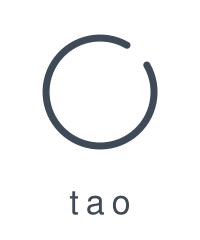

# Tao

**Local-first AI coding workflow orchestration for planning, verified slices, isolated Git worktrees, exact-diff review, recovery, and safe merges.**

[](https://github.com/iamseth/tao/actions/workflows/ci.yml)
[](LICENSE)
[](go.mod)
[](https://github.com/iamseth/tao/releases)
<div align="center">
  <picture>
    
  </picture>
</div>


Tao augments supported coding agents with a durable local workflow for turning a request into small, reviewable changes:

1. **Plan** the outcome with `/tao-plan`.
2. **Slice** the plan into bounded steps with `/tao-slice`.
3. **Validate** its artifacts and checks with `tao validate`.
4. **Run** each slice in an isolated Git worktree with `tao run`.
5. **Review** the exact plan diff; inspect or refresh the result with `tao review`.
6. **Merge or hand off a PR** with `tao merge` or the pull-request run path.

Tao keeps plans, execution evidence, and recovery state locally. It validates agent-proposed commits, verifies completed work, and binds review to an exact base and head before integration. A PR-path plan becomes `completed` when its approved review and PR metadata describe the same non-empty head; that means the PR handoff is complete, not that the host merged it. **A completed PR handoff does not prove integration; only current `plan_merged` evidence proves default-branch integration.**

For workflow guidance, see the [usage guide](docs/usage-guide.md). For the artifact and lifecycle contract, see the [plan format](docs/plan-format.md).

### Where Tao fits

| Category | Primary role | Tao's relationship |
| --- | --- | --- |
| Coding agents | Generate and change code | Tao augments supported agents with planning, execution, evidence, and integration controls. |
| Spec-only frameworks | Structure requirements or plans | Tao carries a sliced plan through verified implementation, review, and integration. |
| Worktree session managers | Isolate or organize coding sessions | Tao creates managed execution worktrees as part of a durable plan lifecycle. |
| Autonomous PR agents | Independently produce pull requests | Tao orchestrates user-invoked local runs and can hand off a reviewed head to a PR workflow. |

> [!IMPORTANT]
> Tao is not a replacement for your coding agent, a generic parallel-agent dashboard, or a cloud platform. Today it supports Pi and Claude.

---

## Quickstart

### Prerequisites

- macOS or Linux on AMD64 or ARM64. Windows is not currently supported.
- Git and either [Pi](https://github.com/badlogic/pi-mono) or
  [Claude Code](https://docs.anthropic.com/en/docs/claude-code), installed and
  authenticated. Pi is the default; set `TAO_AGENT=claude` to select Claude.
- On Linux, `bubblewrap` (`bwrap`) is required for the OS-confined resolver and
  reviewer sessions used by automatic squash-conflict resolution. `tao doctor`
  reports whether Tao can find it at a supported system path.
- Go 1.26.2 and `make` only if you install from source.

### Install Tao

**Release binary (macOS or Linux):** Download the archive for your OS and
architecture, plus `checksums.txt`, from [GitHub Releases](https://github.com/iamseth/tao/releases).
Verify the archive before extracting it, then move `tao` to a directory on your
`PATH`:

```sh
shasum -a 256 -c checksums.txt --ignore-missing  # macOS
# sha256sum -c checksums.txt --ignore-missing    # Linux

tar -xzf tao_<version>_<os>_<arch>.tar.gz
mkdir -p "$HOME/.local/bin"
install -m 0755 tao "$HOME/.local/bin/tao"
```

Ensure `$HOME/.local/bin` is on `PATH`. Beta and stable releases both publish
checksum-verifiable GitHub assets. Beta releases are GitHub prereleases and do
not enter the stable Homebrew or `tao update` channels.

**Homebrew (stable channel):** When a stable release is available, install its
cask with:

```sh
brew install --cask iamseth/tap/tao
```

**From source:**

```sh
git clone https://github.com/iamseth/tao.git
cd tao
make build
export PATH="$(pwd)/bin:$PATH"
```

Install Tao's managed prompts, then inspect agent discovery and setup issues:

```sh
tao install-prompts
tao doctor
```

`tao doctor` provides diagnostic guidance rather than a guaranteed success
check. For Pi it passively exercises the confined ephemeral configuration and
RPC readiness path without a model request; local readiness does not prove that
remote credentials will be accepted. Follow any actionable setup guidance.

Returning to a repository? Use `/tao-catch-me-up` in Pi or Claude for a read-only,
plain-language highlights list of the last two weeks of local history reachable
from HEAD, grouped by features and fixes with commit references. See the
[usage guide](docs/usage-guide.md#tao-catch-me-up-period-or-focus--catch-up-on-local-changes)
for period and focus examples.

### Complete a first plan

Change to the Git repository you want Tao to manage and register it:

```sh
cd /absolute/path/to/your/repository
tao init
```

Start Pi or Claude in that repository, then enter:

```text
/tao-plan add a --hello flag to the CLI
/tao-slice
```

`/tao-slice` prints the new plan ID. Back in your shell, substitute that exact ID
and run the plan:

```sh
PLAN_ID=20260827-175616-add-hello-flag # replace with the printed plan ID
tao validate "$PLAN_ID"
tao run "$PLAN_ID"
tao review "$PLAN_ID"
```

If `tao run` reports that a slice needs approval, inspect the request, approve
that slice, and rerun the plan:

```sh
SLICE_ID=001-add-hello-flag # replace with the requested slice ID
tao approve --slice "$SLICE_ID" --by you "$PLAN_ID"
tao run "$PLAN_ID"
```

For a solo local workflow, integrate an approved exact-base/head review with:

```sh
tao merge "$PLAN_ID"
```

Tao executes declared slice gates before commit intent; optional agent claims
cannot authorize completion. Gates run locally (not sandboxed or cryptographically
attested), with a ten-minute command bound within the remaining agent-session
budget. Final repository verification is unchanged. See the
[evidence contract](docs/plan-format.md#observed-slice-verification).

Tao creates isolated execution worktrees, runs repository verification, and
keeps plans, reviews, execution evidence, and recovery state under its local
data home. That data and workspace-local `.tao/` metadata are local-only; do not
commit them. Tao changes source and Git history only through the workflow steps
you invoke.

You can choose the pull-request run path instead of local merge. In that path,
`completed` means an approved review and PR metadata identify the same non-empty
head; it records a completed handoff, not a host-side merge. Only current
`plan_merged` evidence proves default-branch integration.

For workflow choices, interruption recovery, and rework guidance, see the
[usage guide](docs/usage-guide.md). For artifact and lifecycle details, see the
[plan format](docs/plan-format.md).

---

## Command reference

`tao help` is the canonical command index, and `tao <command> --help` shows the
current flags, examples, aliases, and recovery guidance for that command. Public
commands also accept the short unambiguous prefixes shown by help.

| Command group | Commands | Use |
| --- | --- | --- |
| Plan | `list`, `show`, `report`, `note`, `validate`, `staleness`, `edit`, `abandon`, `delete` | Capture backlog items and inspect, validate, share, or maintain local plans. |
| Planner routing | `tao route show <route-id>`, `tao route list`, `tao route link <route-id> <plan-id>` | Inspect the local routing ledger or repair a same-repository plan link; all accept `--repo REPO` and `--json`. |
| Execution | `run`, `commit`, `approve`, `review`, `rework` | Execute slices, satisfy gates, inspect exact-diff reviews, and address findings. |
| Workspace and cleanup | `workspace`, `cleanup`, `merge` | Inspect managed worktrees, clean eligible Git state, and integrate approved plans. |
| Repository | `init`, `repo`, `steal` | Register checkouts, inspect repository configuration and health, and fetch a read-only scouting snapshot. |
| Monitoring | `ui`, `monitor`, `status`, `insights`, `log` | See cross-repository work, resolved settings, telemetry, and run logs; `insights` offers `--digest` or `--scorecard`, optionally with `--all-repos`. |
| Prompts and agents | `prompt`, `draft-prompt`, `install-prompts` | Render, save, and install Tao's agent prompts. |
| Settings | `completion`, `doctor`, `update` | Configure shell support, diagnose setup, and update release binaries. |
| Other | `version`, `slice-complete`, `slice-blocked` | Inspect the build or support Tao-managed agent lifecycle handoffs and compatibility. |

### Everyday command paths

Open the terminal dashboard to browse plans and notes across registered
repositories, launch common actions, and inspect settings and diagnostics:

```sh
tao ui
tao monitor --once # non-interactive snapshot
```

A typical execution path uses `tao run <plan>`, `tao review <plan>`, and then
`tao merge <plan>`. If a review requests changes, `tao rework <plan>` creates
bounded follow-up slices; `tao rework --run <plan>` immediately hands them back
to the ordinary run path. Use `tao show <plan>` whenever you need Tao's
recommended next action.

An ordinary `tao run` performs automatic repair of an eligible code-classified
final-verification failure in the same invocation, within a fixed lifetime cap
of two generated attempts and any `--max-slices` limit. For a plan already stopped
in `verification_failed`, use the explicit single-shot command below. After the
cap, repair and commit the source manually on the same branch, leave the worktree
clean, and explicitly reverify at the failed head or its descendant:

```sh
tao run --repair-verification <plan> # stopped code failure; one attempt if budget remains
tao run --reverify <plan>            # resolved external cause or manual fix after the cap
```

Generated verification-repair slices are system-owned: `tao edit skip` and
`tao edit remove` refuse them. If unfinished work is intentionally no longer
needed, record that terminal outcome without deleting its history:

```sh
tao abandon --reason "superseded by a different approach" <plan>
```

Abandonment preserves plan and workspace evidence and does not clean branches
or worktrees. Tao refuses it while a durable lifecycle transaction still needs
recovery.

For an approved set of independent plans, preview batch integration before
running it:

```sh
tao merge --all --dry-run
tao merge --all
tao merge --all --auto-eject
tao log --batch --follow # follow active batch transitions from another terminal
```

Batch merge keeps the default branch unchanged until the combined result passes
full verification and aggregate review. If recurring aggregate findings can be
attributed to one plan and removing it leaves work to land, the default behavior
stops and offers ejection on the next rerun. `--auto-eject` opts into ejecting
that plan and rebuilding, reverifying, and reviewing the reduced batch in the
same run.

`tao report --output PATH <plan>` writes a share-safe Markdown projection for
coworkers with repository access; review it before sharing. See the
[plan report format](docs/plan-report.md) for its safety contract.

The [usage guide](docs/usage-guide.md) covers workflow judgment and the detailed
run/retry, review/rework, pull-request, standalone-commit, and merge recovery
paths. Use command help for exact flags and for operational details such as
update checks:

```sh
tao run --help
tao merge --help
tao update --help
```

For plan artifact and lifecycle semantics, see the
[plan format](docs/plan-format.md).

## Configuration

Most setup needs only an agent selection and, when desired, a non-default local
data location or execution policy:

```sh
TAO_AGENT=pi|claude
TAO_THEME=tokyonight|gruvbox            # shared CLI/TUI palette; default: tokyonight
TAO_MODEL=provider/model                # optional shared base
TAO_RUN_MODEL=provider/model            # implementation and rework slices
TAO_REVIEW_MODEL=provider/model         # plan review and proposal correction
TAO_MERGE_REVIEW_MODEL=provider/model    # aggregate merge review
TAO_RESOLVER_MODEL=provider/model        # merge conflict and rework resolution
TAO_REWORK_ESCALATION_MODEL=provider/stronger-model # optional late automatic rework
TAO_REWORK_ESCALATION_FROM_ATTEMPT=4     # first eligible attempt in each window
TAO_DATA_HOME=/path/to/tao-data
TAO_COMMIT_POLICY=slice|none
TAO_EXECUTION_MODE=isolated|current
```

Runtime-table settings are captured once per invocation. Boolean settings accept
trimmed, case-insensitive `true/false`, `1/0`, `yes/no`, `on/off`, `t/f`, and `y/n`.
For example, `TAO_RUN_HEADER=false` disables the TTY-only run header.

Invalid settings are rejected by name only when an operation consumes them,
including invalid advisory-budget overrides and hard caps; unused settings do
not block unrelated commands. Invalid `TAO_THEME` and `TAO_RUN_HEADER` values
instead warn and retain their defaults (`tokyonight` and enabled).
Help, `tao status` (`--json` for automation), and the TUI Settings/Debug views
remain available to diagnose invalid configuration, including `TAO_UPDATE`.
Diagnostics retain every runtime-table setting, even when another is invalid.

Pi is the built-in default agent, `slice` is the default commit policy, and
`isolated` is the default execution mode. Historical `plan` commit-policy
metadata remains readable, but new runs accept only `slice` or `none`. Tao does
not load `.env` files. Repository settings override environment and built-in
defaults, and explicit per-run flags override repository settings, including
explicit `false` values. Model settings are optional; unset roles inherit the
base model, and with no model settings Tao leaves the runtime's selection
unchanged. Manage the current repository's defaults independently:

```sh
tao repo config --pull-request true
tao repo config --pull-request false
tao repo config --pull-request unset
tao repo config --model provider/model
tao repo config --run-model provider/implementation-model
tao repo config --run-model unset # remove this default and restore inheritance
tao repo config --rework-escalation-model provider/stronger-model
```

Planner routing applies only to `tao note run`:

- `TAO_PLANNER_ROUTING=off|shadow|randomized`: `off` is the default; shadow records assignments without changing the planner, randomized selects its runtime.
- `TAO_PLANNER_ROUTING_ARMS=pi,claude`: default equal-weight runtimes; alternatively use explicit probabilities summing to 1, such as `pi=0.7,claude=0.3`.
- `TAO_PLANNER_ROUTING_FLOOR=0.1`: default minimum configured arm probability in randomized mode; accepts a finite value from 0 to 0.5.

`tao note run --planner-routing MODE` overrides the mode for one invocation;
`--planner-arm pi|claude` records a manual override to an installed eligible arm
when routing is enabled (shadow still leaves the planner unchanged). Provider,
model, and reasoning effort remain inherited. See the
[usage guide](docs/usage-guide.md#planner-routing-for-tao-note-run) before enabling
randomized routing.

Repository model flags are `--model`, `--run-model`, `--review-model`,
`--merge-review-model`, `--resolver-model`, and `--rework-escalation-model`;
each accepts a name or `unset`.
For a one-invocation override of every role, use `tao run --model NAME <plan>`,
`tao review --run --model NAME <plan>`, or `tao merge --model NAME <plan>`
(including `tao merge --all --model NAME`). See the
[model selection guide](docs/usage-guide.md#choose-models-for-agent-sessions)
for precedence and runtime rejection behavior.

Escalation is opt-in and separate from role selection: use
`tao run --rework-escalation-model NAME <plan>` for a one-run policy override.
The attempt threshold is environment-only (default 4); without an effective
escalation model, rework is unchanged. A model already recorded for a round
still wins at execution time. See the
[rework guide](docs/usage-guide.md#escalate-late-automatic-rework)
for attempt counting and durable selection.

Run `tao status` to see the resolved `TAO_*` runtime values and repository plan
rollups (`tao status --json` for automation). Use `tao run --help` and
`tao merge --help` for exact one-run overrides covering review, rework, pull
requests, permissions, and integration. Configure the agent session timeout with
`TAO_SESSION_TIMEOUT`; set it to `0` to disable the timeout.

### Budgets

Agent budgets use one `TAO_BUDGET_<SCOPE>_<METRIC>_WARN` scheme, where `<SCOPE>`
is `SLICE` or `PLAN` and `<METRIC>` is `OUTPUT_TOKENS`, `COST`, `TOOL_CALLS`,
`ASSISTANT_MESSAGES`, or `ERRORED_MESSAGES`. Crossing a `WARN` value only records
an advisory warning. The two `STOP` caps are enforced: crossing one records
`budget_exceeded` and blocks the slice. Each `STOP` value must be at least its
`WARN` value. The built-in defaults are:

```sh
TAO_BUDGET_SLICE_OUTPUT_TOKENS_WARN=40000
TAO_BUDGET_SLICE_COST_WARN=5
TAO_BUDGET_SLICE_TOOL_CALLS_WARN=120
TAO_BUDGET_SLICE_ASSISTANT_MESSAGES_WARN=80
TAO_BUDGET_SLICE_ERRORED_MESSAGES_WARN=0   # warn on any
TAO_BUDGET_PLAN_OUTPUT_TOKENS_WARN=150000
TAO_BUDGET_PLAN_COST_WARN=20
TAO_BUDGET_PLAN_TOOL_CALLS_WARN=400
TAO_BUDGET_PLAN_ASSISTANT_MESSAGES_WARN=300
TAO_BUDGET_PLAN_ERRORED_MESSAGES_WARN=0    # warn on any
TAO_BUDGET_SLICE_OUTPUT_TOKENS_STOP=       # disabled by default; explicit 0 is a hard cap
TAO_BUDGET_SLICE_COST_STOP=                # disabled by default; explicit 0 is a hard cap
```

The former `TAO_BUDGET_<SCOPE>_<METRIC>` and `TAO_MAX_SLICE_*` names are
accepted as deprecated aliases for one release, yield to a set canonical key,
and appear in `tao status` only when set.

---

## Development

See the [contributing guide](CONTRIBUTING.md) for repository conventions and
local development guidance. Run the canonical `make verify` gate before opening
a pull request. Agent contributors should also follow [`AGENTS.md`](AGENTS.md).

The repo-local Pi extension hosts `/tao-commit`, `/tao-compose-reply`, and the
Ctrl+G reply composer. Its [extension guide](extensions/pi/README.md) covers
behavior, compatibility, testing, and deployment.

### Releasing (maintainers)

GitHub Actions and GoReleaser publish checksum-verifiable beta and stable
releases. Follow the [maintainer releasing guide](docs/releasing.md) for the
authoritative preparation, tagging, verification, channel, and failure
procedures.
