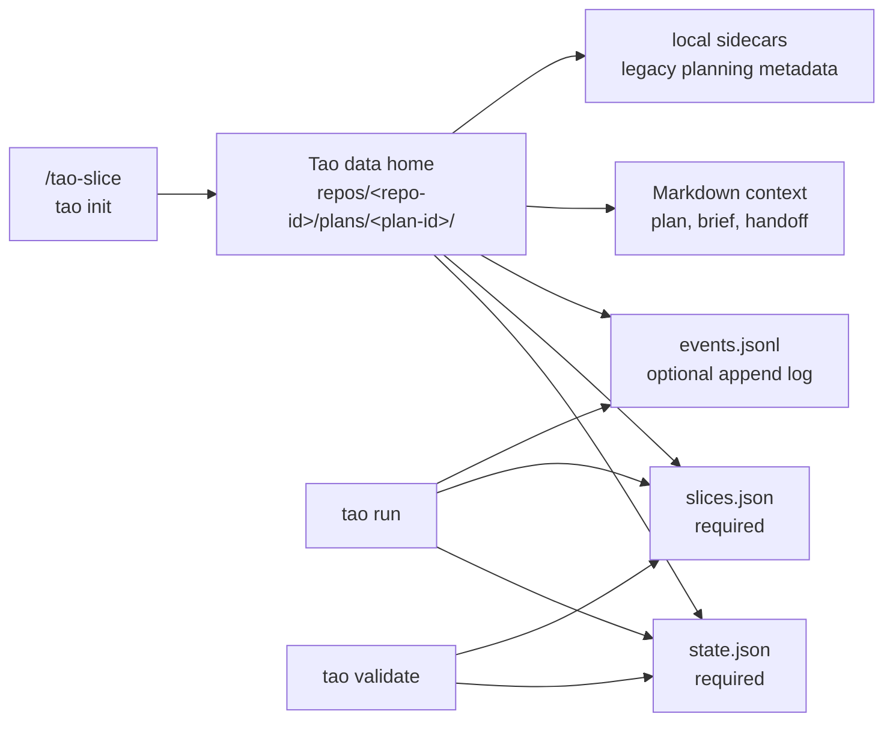
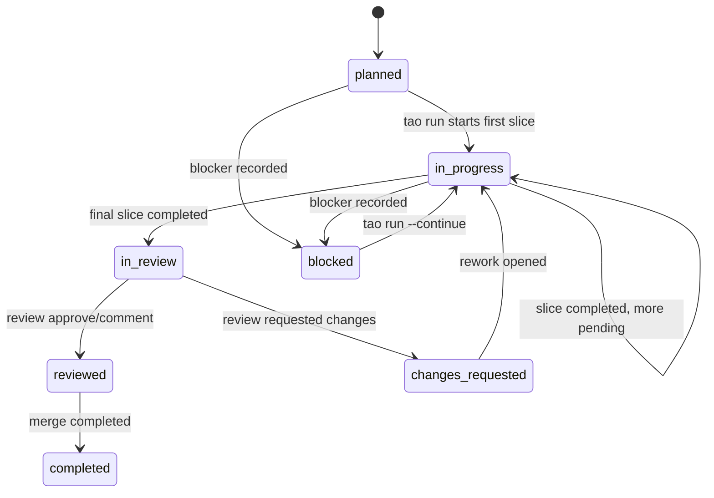
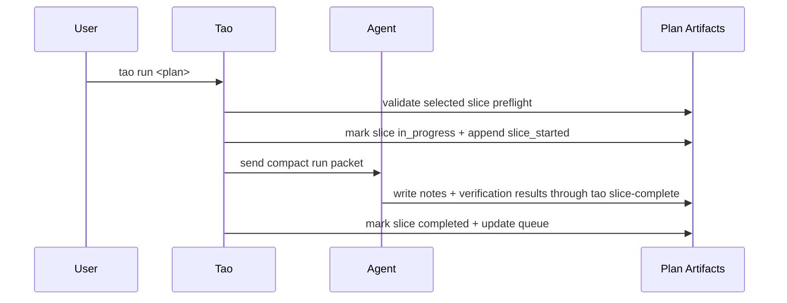

# Tao Plan Format

Tao plans are local execution artifacts for agent work. They preserve planning intent, divide work into serial slices, and record progress as slices run.

This document is the artifact contract for Tao contributors and advanced users. For the day-to-day workflow, start with the project [`README.md`](../README.md).



## Plan Directory

A plan directory is usually allocated by `/tao-slice` through:

```sh
tao init --slug <short-slug> --json
```

The command registers the current Git repository and returns `plan.dir` under Tao's data home:

```text
$TAO_DATA_HOME or ~/.local/share/tao/
└── repos/<repo-id>/plans/<plan-id>/
```

Normal CLI commands default to the current repository's plan scope. `tao repo list`, `tao repo show <repo-id>`, and `tao repo doctor` inspect the centralized repository registry without mutating repositories. Runtime commands can still read plans from `--plans-dir DIR` or from an explicit plan path when a caller intentionally opts out of the default scope.

Plan loaders validate plan-directory artifacts and must not depend on unrelated data-home sidecars for plan validity.

## File Contract

| File | Loader requirement | New `/tao-slice` expectation | Purpose |
| --- | --- | --- | --- |
| `state.json` | Required | Required | Mutable plan lifecycle and queue state. |
| `slices.json` | Required | Required | Executable slice definitions and verification commands. |
| `events.jsonl` | Optional | Created | Append-only lifecycle and telemetry events. Invalid lines warn, not fail. |
| `.mutation.json` | Recovery-only | Absent when settled | Tao-owned intent for an interrupted required-artifact mutation; never agent-authored plan input. |
| `plan.md` | Optional | Created | Human-readable goal, constraints, decisions, assumptions, risks, and slice overview. |
| `planning-brief.md` | Optional, warning if missing/malformed | Created | Fixed-section compact planning summary for future build agents. |
| `handoff.md` | Optional | Created | Concise future-agent context without duplicating Tao-owned run protocol. |

Legacy planning-session sidecars are not part of the live contract. See [Legacy / backward-compatibility (read-only)](#legacy--backward-compatibility-read-only).

### Recoverable required-artifact mutations

Tao-owned lifecycle operations that jointly persist `state.json`, `slices.json`,
and lifecycle events use `.mutation.json` as a private roll-forward journal. The
journal is made durable before any listed target changes. Full plan loads and
state-only reads validate and settle a pending journal before returning artifact
state; retries install exact hashed payload bytes, append only missing
`(mutation_id, payload hash)` events, and durably remove the journal last.
Malformed, mismatched, or unsupported journals make the plan unreadable until an
operator preserves and repairs the intent; Tao never guesses, rolls back, or
automatically deletes invalid intent.

The journal does not change the public schemas of required artifacts except that
transaction-owned events may carry `mutation_id`. It is owned by Tao's plan
persistence layer, not by agents or individual run/review/merge consumers. Plans
without a journal retain the legacy tolerant load path, including historical
torn state/slices combinations and events without `mutation_id`. See
[Plan Mutation Journal](plan-mutation-journal.md) for the byte-level protocol and
remaining limitations.

## Context Markdown

### `planning-brief.md`

New plans should include a concise planning brief with these fixed headings:

- `User Goal`
- `Constraints`
- `Non-goals`
- `Expected Files/Packages`
- `Validation Strategy`
- `Open Questions`

Missing or malformed briefs are warning-only findings so existing plan directories remain compatible.

## State Lifecycle

Plan status values:

| Status | Meaning |
| --- | --- |
| `planned` | Plan exists but no slice is currently running. |
| `in_progress` | At least one slice has started or work remains after a completed slice. |
| `in_review` | All slices are complete and the plan is awaiting a successful review. |
| `reviewed` | Review completed without requested changes; an approved review may be merged. |
| `changes_requested` | Review completed with requested changes; use `tao rework` or address manually. |
| `completed` | The reviewed plan has been merged into the default branch. |
| `blocked` | Work cannot continue without a fix, decision, approval, or dependency. |

A merge is proven by a `plan_merged` event in `events.jsonl`. Plans written by releases predating merge-event tracking may carry `status: completed` without one; status projection trusts that persisted legacy status (the plan finished under the old semantics, typically merged manually or before merge events existed) rather than demoting historical plans to `in_review` on upgrade. The current write path only ever stores `completed` through the merge recording that also appends the event, so new plans always carry both.

`state.json` owns repository context and the queue. New plans should record `repo.base_commit` as the Git commit that was current when the plan was sliced; `tao review PLAN` uses it to detect likely stale pending slices after later commits.

- `plan.current_slice` is the selected slice while work is active.
- `plan.pending_slices` is ordered and drives the next runnable slice.
- `plan.completed_slices` records completed slice IDs.
- `plan.last_run_commit_policy` records the effective commit policy (`slice` or `none`) from the latest run start. The historical value `plan` remains readable, but new run, prompt, environment, and queue inputs reject it with migration guidance. Missing values and legacy `run_context` fallback remain supported.
- `plan.last_run_starting_dirty` records the Git paths dirty at the latest run start; automatic `slice` starts store an empty list because they require a clean execution tree, while legacy and manual-policy records remain readable.
- Optional `plan.final_verification` records the repository-wide pre-review gate with `command`, absolute `cwd`, `result`, optional `details`, and `verified_at`. When no repository-owned command is detected, Tao records a skipped result rather than inventing a command.
- Optional `plan.review.commit_message` is the untrusted proposal produced by the reviewer of the exact recorded `base..head` diff. It has `subject` and `body` strings; the subject is `<type>(<lowercase-scope>): <lowercase-imperative-summary>`, and the body has non-empty canonical `What:` and `Why:` sections. It must not contain `Tao-*` trailers. New `approve` reviews require a valid proposal; a missing, malformed, oversized, or reserved-trailer proposal downgrades the parsed result to bounded `comment` rather than persisting approval. `changes_requested` and `comment` reviews store `commit_message: null`, explicitly clearing a stale approved proposal. Historical reviews without this field remain readable.
- Optional `plan.merge_commit_intent` binds `message`, `plan_id`, `source_head`, `default_branch`, `default_parent`, and `created_at` before a single squash mutates Git. `message` is the exact final validated review (or exceptional generated) proposal plus Tao-owned evidence. Matching retries reuse it without another agent call. Historical intents remain exact recovery authority and are not reformatted.
- Optional `workspace.rebase_intent` is written before a workspace rebase mutates Git. It binds the workspace `branch`, `base_branch`, `old_head_sha`, `old_base_sha`, `new_base_sha`, ordered `commit_count`, versioned `commit_series_fingerprint`, and UTC `created_at`. The fingerprint proves the exact linear `old_base_sha..old_head_sha` feature series from rebase-stable commit metadata, messages, and content changes; ancestry alone is not proof. Current `v5` fingerprints bind each edit to its immediately adjacent unchanged context, reject ambiguous locations, and canonicalize paths through upstream rename detection while retaining destination-file identity. This distinguishes duplicate edit locations, survives conflict-free upstream renames, and prevents a distant newly unique line from displacing an anchor. Historical `v1`, ordinal-based `v2`, nearest-unique-anchor `v3`, and adjacent-context `v4` intents remain readable but cannot match a newly computed `v5` recovery proof. Plans without this field remain readable.

`workspace.rebase_intent` uses `omitempty` and therefore preserves an existing
value when an ordinary typed update has a nil intent. Tao clears settled intent
only through the artifact change contract, which writes an explicit
`"rebase_intent": null` while preserving unknown workspace fields. Successful
rebase settlement verifies the exact intent and writes the new base, HEAD, and
workspace status fields in the same refreshed artifact mutation as that clear.
Exact re-recording is idempotent; conflicting replacement, mismatched clearing,
or mismatched settlement is refused.



First-class plan edits mutate only pending work:

- `tao edit remove PLAN SLICE` removes a pending slice from `slices.json` and `plan.pending_slices`.
- `tao edit skip PLAN SLICE` removes a pending slice from `plan.pending_slices` and keeps its slice record with status `skipped`.
- `tao edit move PLAN SLICE --before ID` and `--after ID` reorder only `plan.pending_slices`.

Edit mutations must reject completed, in-progress, blocked, missing, or dependency-invalid slices and keep `state.json` and `slices.json` consistent.

When an opt-in full run successfully creates a GitHub pull request, `state.json` may include `plan.pull_request` with the PR `number`, `url`, and `created_at` timestamp. This metadata is durable so renderers can show a stable PR link after restart.

## Slice Lifecycle

Slice status values mirror plan status where useful:

| Status | Meaning |
| --- | --- |
| `pending` | Waiting to run. |
| `in_progress` | Selected and started by Tao. |
| `completed` | Finished and verified. |
| `blocked` | Cannot continue without outside action. |
| `skipped` | Intentionally removed from the pending queue while retained for audit. |

Each slice should include:

- A stable `id`, such as `001-short-name`.
- A short `title`, `goal`, and implementation `tasks`.
- `depends_on` for serial dependencies.
- Optional `tags`.
- `expected_files` to describe the intended scope for planning and commit warnings.
- Optional `required_inputs` for concrete repository artifacts that must exist before implementation begins; legacy slices and slices with no prerequisites omit it.
- Optional `execution_root`, recorded by `tao run` at slice start as the absolute checkout or worktree root used for that run; legacy slices may omit it.
- Optional `execution_start`, recording the immutable prepared boundary for an automatic slice. `branch` and `head` identify the original Git boundary; `commit_policy` and `workspace_strategy` preserve the effective execution choices (`slice` plus `worktree` for a resumable isolated run). Legacy records may omit the latter fields, which Tao infers only from durable plan/workspace metadata.
- Optional `commit_intent` written before Git mutation. It contains the completion-input `hash`, `policy`, optional `starting_branch`, `starting_head`, exact final `message`, and `created_at`. For new automatic intents, the hash binds the completion report and message together.
- Optional `completion` with `outcome` and optional `commit_sha`. Outcomes are `committed`, `no_changes`, and `manual_uncommitted`.
- `verification.commands`: every slice must include at least one deterministic verification command; select commands from repository-owned guidance where possible. For docs/config/asset-only slices where no build/test command applies, use a deterministic fallback such as `grep -q`, `test -f`, or `git diff --stat`.

### Required inputs

`required_inputs` is an optional array of filesystem prerequisites. Each entry has:

```json
{
  "path": "generated/schema.json",
  "kind": "file",
  "reason": "The generator output defines the schema consumed by this slice."
}
```

`path` must be a concrete repository-relative path: absolute paths, parent traversal, wildcards, trailing-slash placeholders, and vague paths are invalid. `kind` is exactly `file` or `directory`, and `reason` must be non-blank. Omit the field when the slice needs no repository artifact before work begins; plans that predate this field remain readable and runnable without migration.

During whole-plan validation, a missing input is allowed as a warning only when a slice named directly in the consumer's `depends_on` declares the exact normalized path in its `expected_files`. Serial order, transitive dependencies, prefixes, wildcards, and near matches do not establish a producer contract. At selected-slice preflight, the artifact must actually exist with the declared kind in the prepared execution worktree. A producer declaration does not waive that runtime check.

These commit fields are optional for backward compatibility: plans completed
before transactional slice commits load without them. Under policy `slice`, a
new intent requires a bounded proposal from the active implementation agent.
Tao centrally validates the supported type, lowercase scope and imperative
summary (at most 72 characters), and non-empty `what`/`why`; it then formats
canonical `What:`/`Why:` sections and appends exact `Tao-Plan: <plan-id>` and
`Tao-Slice: <slice-id>` trailers. Proposal-supplied `Tao-*` lines are invalid.
Invalid content stops before intent, staging, or commit and may be repaired in
the same session; there is no deterministic or title fallback.

The exact final formatted message is stored in `commit_intent.message` and is
part of the new intent hash. A modifying completion records `committed` and its
SHA; no diff records `no_changes` without creating an empty commit (the boundary
HEAD may be retained as `commit_sha`). Policy `none` records
`manual_uncommitted` and does not mutate Git. On retry, Tao may recover an
already-created commit only when HEAD's parent is the intent's `starting_head`
and the full commit message, including trailers, matches the intent.

Legacy intents whose hash predates message binding retain their recorded message
verbatim and settle through the historical commit path; they are never
revalidated, rewritten, or upgraded in place. This compatibility is recovery,
not a fallback for a new proposal.

> **Upgrade warning:** if Tao is upgraded while an automatic commit transaction
> already has `commit_intent`, that active transaction keeps its historical
> message contract until it settles. The stronger proposal contract begins at
> the next pre-intent transaction; do not delete intent or restart an agent to
> force an in-flight transaction onto the new format.



Approval-gated work uses an `approval` object. A runner must stop before implementation when approval is required but not granted. `tao approve [--slice ID] [--by NAME] <plan>` sets `approval.approved`, `approval.approved_by`, and `approval.approved_at`, preserves existing approval metadata on repeated approval, and does not execute work.

`tao run` owns deterministic start bookkeeping after selected-slice preflight passes and before invoking the agent: it sets the plan and selected slice to `in_progress`, updates start and last-activity timestamps, records `plan.current_slice`, and appends one `slice_started` event per slice attempt sequence. Agents should not duplicate this metadata during normal runs.

An interrupted in-progress automatic slice is classified from durable slice/workspace fields and live Git state before Tao prepares or mutates a workspace. An isolated pre-intent slice may resume in its recorded worktree only when the execution root, branch, HEAD, clean-start metadata, policy, and strategy still match and no conflict or Git operation is active. Tao preserves staged, tracked, and untracked paths; it never moves the recorded boundary. A clean start whose lifecycle write was torn before `execution_start` may be repaired from matching prepared workspace metadata. Dirt without that immutable boundary is not attributable and is refused. Current-checkout or policy-`none` work remains manually owned rather than being auto-resumed.

Resume attempts do not append another `slice_started` event. Each agent handoff appends `slice_resume_attempted` with its numbered `attempts` value; a failed handoff best-effort appends `slice_resume_failed` with the same attempt number and failure reason. These events are audit history, not recovery evidence: provider errors, metrics, and event availability never authorize a retry or redefine the execution boundary.

Within one implementation-slice invocation, Tao may automatically attempt at most two resumes after explicitly structured retryable transport failures, using fixed context-cancellable delays of 1 second and 2 seconds. Each attempt reloads artifacts, repeats selected-slice verification preflight, and must receive `InterruptedSliceResume` authorization from the same execution-boundary classifier described above before a fresh provider session starts. The budget is invocation-local and is independent of durable resume-attempt numbering. A durably completed slice is accepted after ordinary progress and completion-boundary validation without another handoff. This changes no event or artifact schema and adds no retry configuration.

The current structured source is Pi's `provider_transport_failure` diagnostic. Matching text, generic and authentication errors, session timeouts, planning, review, pull-request, and merge sessions, and manual, policy-`none`, unsafe, or post-`commit_intent` states do not retry. In particular, neither a provider error nor an `agent_metrics`, `slice_resume_attempted`, or `slice_resume_failed` event is authorization; the durable execution facts and live Git boundary remain the sole recovery authority.

Normal `tao run` rejects blocked plans and blocked selected slices. `tao run --continue` is only for cases where the blocker has already been cleared manually; it clears Tao's blocked lifecycle state and restarts `plan.current_slice`, or falls back to the first pending slice only when the plan or that slice is blocked. Continue mode must not bypass approval gates, dependencies, completed-plan checks, missing-slice checks, branch or commit safeguards, or selected-slice verification preflight.

`tao slice-complete --plan-dir DIR --slice-id ID --notes-file FILE --verification-results-file FILE [--commit-proposal-file FILE]` owns deterministic completion bookkeeping after verification passes. A new automatic slice intent requires the structured proposal file; Tao validates it and persists the exact trusted final message before staging. Existing intents settle from durable state and do not require or authorize a fresh proposal session. Tao creates or recovers the commit, persists `completion`, then marks the slice completed and moves the queue. Policy `none` skips Git and records `manual_uncommitted`. State, timing, notes, verification results, and at most one `slice_completed` event are written only after the transaction outcome is known.

Recovery is split at `commit_intent`. Before intent, only an exact isolated automatic boundary can return to the implementation agent. Once `commit_intent` or `completion` exists, Tao does not start an agent: the original `tao slice-complete` inputs must settle or recover that transaction. Changed branch/HEAD boundaries, active Git operations, conflicts, ambiguous status, and unrelated dirt without a boundary are refusal states, not alternate baselines. Direct and queued execution apply this same classification through `run.Service.Execute` while retaining one cross-process plan lock.

## ID Resolution

New plan IDs are generated in UTC as `YYYYMMDD-HHMMSS-slug`. Plans allocated in the same second may share the timestamp and are distinguished by their slug; an identical timestamp and slug retains the numeric collision suffix. Legacy minute-level `YYYYMMDD-HHMM-slug` IDs remain supported without renaming or migration.

CLI commands accept exact plan IDs, unique ID prefixes, and unique slug or slug-prefix aliases for both shapes. Ambiguous prefixes are errors.

`tao run` also accepts a filesystem path to a plan directory or a file inside one.

## Validation

Plan loading should validate consistency without making list views brittle:

- `state.json` and `slices.json` are required.
- `events.jsonl` is optional.
- Invalid plan directories are surfaced as warning summaries in list output.
- Malformed event lines are preserved as warnings while valid events still load.
- Completed plans should have no current slice and no pending slices.
- `plan.pending_slices` should contain each queued ID at most once and should otherwise reference pending slices only. The one narrow exception is the entry matching `plan.current_slice`, which remains queued while that slice is `in_progress` or `blocked`; a blocked current slice missing from a non-empty pending queue is inconsistent.
- `plan.completed_slices` should reference completed slices only; skipped slices stay out of both pending and completed queues.

Input-readiness errors are limited to malformed plan structure and explicit `required_inputs` facts. Whole-plan validation checks every declaration and permits only the exact direct-producer warning described above. Run preflight checks only the selected runnable slice against its prepared execution worktree; missing, unavailable, or wrong-kind declared inputs block before lifecycle mutation or agent handoff.

Verification-command semantic analysis is additive and advisory. A missing or entirely blank `verification.commands` list is malformed slice structure and blocks, but findings about command working directories, arguments, package context, or referenced files remain warnings. Tao does not execute verification commands during readiness and does not treat supported analyzer patterns as proof that it understands arbitrary command semantics.

Queued runs must pass repository health checks against the plan's recorded `state.repo.root`. Missing roots, non-Git roots, and metadata errors block execution while remaining visible in CLI repository views.

Command analysis is intentionally conservative and covers common documented forms only, including:

- `cd DIR && COMMAND`
- `pnpm --dir DIR ...`
- `pnpm --filter PACKAGE ...`
- direct `go test`
- direct Vitest or Jest-style file arguments

Commands that execute from a package cwd should use package-relative test paths. For example, prefer:

```sh
pnpm --filter api exec vitest src/user.test.ts
```

over:

```sh
pnpm --filter api exec vitest services/api/src/user.test.ts
```

when `services/api` is the package cwd.

When a listed verification command is invalid but a mechanically equivalent corrected command succeeds, slice metadata should preserve both command results so invalid command setup is distinguishable from code or test failure.

## Clearable fields and the merge-write contract

`writeJSON` deep-merges every write over the on-disk JSON rather than replacing it wholesale. This preserves unknown fields from older agent runs. Clearable fields currently use one of two mechanisms:

**Tag-cleared fields omit `omitempty`.** Marshalling an explicit zero, nil, or empty value emits the key — `null` for pointers, `""` for strings, `[]` for slices — and the merge overwrites the prior stored value.

**Seam-cleared fields use `omitempty` to preserve by default.** A zero-value write omits the key and preserves the stored value unless the writer declares field-specific intent through `ArtifactChangeSet`. The persistence seam lowers that intent to the same explicit `null`, `""`, or `[]` representation before the unknown-field-preserving merge.

### Known clearable fields

| Field | Type | JSON key | Clear mechanism |
| --- | --- | --- | --- |
| `State.Plan.CurrentSlice` | `*string` | `current_slice` | Seam-cleared: lifecycle completion, reopen, and plan-edit transitions declare `ClearPlanCurrentSlice`, storing `null`; an undeclared `nil` preserves the stored current slice. |
| `PlanState.LastRunCommitPolicy` | `string` | `last_run_commit_policy` | Write `""` → stored as `""`; clears the persisted run policy so review uses legacy event fallback or `none`. |
| `PlanState.LastRunStartingDirty` | `[]string` | `last_run_starting_dirty` | Write `[]string{}` → stored as `[]`; clears stale run-start dirty-path tolerance after a clean run start. |
| `PlanState.Review` and known `PlanReview` fields | review block | `review` | Seam-cleared: `ReplacePlanReview` replaces every known field, storing explicit zero values including `findings: []` and `commit_message: null`; `ClearPlanReview` stores `review: null`. Undeclared zero values preserve stored review data. Unknown keys inside a replaced review object survive. |
| `PlanState.MergeCommitIntent` | `*SingleMergeCommitIntent` | `merge_commit_intent` | Write `nil` → stored as `null`; clears only through guarded single-merge intent settlement or supersession. |
| `Workspace.DependencyFailure` | `string` | `dependency_preparation_failure` | Seam-cleared: `ClearWorkspaceDependencyFailure` plus `PersistStateChanges` stores `""` after retry success; an undeclared empty value preserves the stored failure. |
| `Workspace.DependencyFingerprint` | `string` | `dependency_fingerprint` | Seam-cleared: `ClearWorkspaceDependencyFingerprint` plus `PersistStateChanges` stores `""` when successful-install evidence is unknown; an undeclared empty value preserves prior evidence. |
| `Slice.BlockerNote` | `string` | `blocker_note` | Seam-cleared: blocked continuation declares `ClearSliceBlockerNote`, storing `""`; an undeclared empty value preserves the stored blocker note. |

### Known merge-only fields (omitempty)

These fields carry `omitempty`. A later write with a zero value does **not** clear a previously stored non-zero value unless the field is listed above with typed seam intent:

- `State.Workspace` — the whole struct pointer (`omitempty`)
  - `Workspace.Branch`, `BaseSHA`, `HeadSHA`, and other Workspace sub-fields without a seam clear. `Workspace.DependencyFailure` and `Workspace.DependencyFingerprint` also carry `omitempty`, but are seam-clearable and listed above.
- `Repo.BaseCommit`
- `PlanState.CurrentSlice` carries `omitempty`, but is seam-clearable and listed above.
- `PlanState.PullRequest` — the whole struct pointer (`omitempty`)
- `PlanState.Review` and its known sub-fields carry `omitempty`, but the block is seam-replaceable or seam-clearable and listed above.
- Slice fields: `ExecutionRoot`, `Tags`, `Approval`, `Notes`, `VerificationResults`. `BlockerNote` also carries `omitempty`, but is seam-clearable and listed above.

The four migrated groups are `Workspace.DependencyFailure`/`DependencyFingerprint`, `Slice.BlockerNote`, `State.Plan.CurrentSlice`, and the `PlanState.Review` block with its known sub-fields. All remaining fields in the table retain the tag-driven clear contract.

Changing a tag-driven clearable field to `omitempty` requires migrating every writer to a typed seam clear in the same change; otherwise explicit-zero writes silently preserve stale data. Removing `omitempty` from a merge-only field is a deliberate schema extension. Both changes require contract coverage in `internal/plan/clearable_fields_test.go`.

## Legacy / backward-compatibility (read-only)

New plans never create these; documented only so old plan directories still load.

Planning-session capture is no longer supported. If optional legacy planning-session sidecars are present in a local plan directory, loaders may display them as best-effort audit metadata, but missing sidecars must not warn, fail validation, or block execution. These files are local-only metadata, and built-in Pi and Claude run support does not write transcript or session sidecars.

| File | Purpose |
| --- | --- |
| `planning-session.json` | Legacy local planning-session export. Tao tracks its presence and path but does not decode it into core plan models. |
| `planning-session-stats.json` | Legacy Tao-owned planning-session summary, including planning agent when known, session ID, repository root, timestamps, provider/model, usage, cost, and stale-metadata status. |
| `planning-prompt.md` | Legacy extracted planning prompt text used to create the plan. |

`agent` records the planning runtime when known, such as `pi` or `claude`. It is audit metadata only; plans remain portable and may be run by any supported agent runtime later. `planning_started_at` records when the `/tao-slice` prompt began. It intentionally lives in `planning-session-stats.json`, not core `state.json` timing. Renderers should round positive canonical planning duration to the nearest second and prefer positive `planning_started_at` duration.

If sidecar metadata appears stale or mismatched, stats should set `capture_suspect` and `capture_suspect_reason`. Stale sidecars must hide all planning metrics, including duration, tokens, messages, cost, model, and tool-call data.

## Telemetry Warnings

Agent budget warnings are informational summaries derived from `agent_metrics` events. Default thresholds are:

| Metric | Threshold |
| --- | ---: |
| Total tokens | `200000` |
| Tool calls | `75` |
| Assistant messages | `50` |
| Errored agent messages | any |

Renderers should show the metric, threshold, observed value, and slice ID when applicable, but warnings must not change plan lifecycle state or block execution.

Run-context telemetry is recorded as `run_context` events before each agent slice attempt. It records whether a compact run packet was rendered and how many warning-level selected-slice guardrail findings were present. This supports prompt-efficiency analysis, but missing telemetry must not invalidate plans or block runs.

## Events

`events.jsonl` records append-only lifecycle and telemetry events.

Known event types include:

| Event type | Purpose |
| --- | --- |
| `plan_created` | Initial event written by `/tao-slice`; may include `agent` for the planning runtime. |
| `slice_started` | Selected slice attempt started. |
| `slice_completed` | Slice completion transaction settled successfully; detailed intent, outcome, and SHA live in `slices.json`. |
| `slice_resume_attempted` | Agent handoff for an interrupted automatic slice was attempted. |
| `slice_resume_failed` | Agent handoff for an interrupted automatic slice failed. |
| `slice_removed` | Pending slice removed by `tao edit remove`. |
| `slice_skipped` | Pending slice skipped by `tao edit skip`. |
| `slices_reordered` | Pending queue reordered by `tao edit move`. |
| `slice_approved` | Approval-gated slice was approved. |
| `pull_request_created` | Pull request created after completed run. |
| `plan_reviewed` | Plan review result was persisted. |
| `plan_reopened` | Plan reopened for rework. |
| `plan_merged` | Plan merged into the default branch. |
| `verification_command_invalid` | Verification command failed before tests loaded. |
| `run_context` | Pre-attempt run-packet and guardrail telemetry. |
| `session_timeout` | Agent session exceeded its wall-clock timeout. |
| `rework_round` | Automatic rework round started. |
| `rework_stopped` | Automatic rework stopped at a persisted safety bound. |
| `final_verification` | Final repository verification result was recorded. |
| `merge_verification` | Merge verification result was recorded. |
| `plan_commit_fallback` | Plan-level commit fell back to the selected agent. |
| `plan_commit_guard` | Plan-level leftover commit guard result was recorded. |
| `agent_metrics` | Agent metrics from run attempts when available. |

Legacy planning-session audit events may also appear in older local plans.

A recurring-file `rework_stopped` event is written after the third consecutive
`changes_requested` review and before another reopen when at least one normalized
primary finding file appears in all three reviews. The current review is the
third observation; the preceding two are reconstructed from the first
`expected_files` entry of slices in the two immediately preceding generated
rework rounds. Associated expected files do not count. Evidence must be safe,
complete, and contiguous for generated rounds after the current rework baseline.
The event's `reason` begins
`automatic rework stalled on files recurring across three consecutive reviews: `
and ends with a sorted JSON string array of the recurring paths. `round` and
`attempts` describe the already-created rounds; the stop does not reopen the plan
or append slices. Existing attempt-cap and exact-fingerprint checks retain their
precedence. The plan remains `changes_requested`, and its current review and
actionable findings remain the operator-facing source of truth.

Direct and queued automatic rework use the same decision policy. Queue snapshots
persist the baseline and bounded progress, so interrupted recovery applies the
third review as one terminal observation, settles the entry as failed, and does
not execute or reopen the plan again. Once the stop event is persisted, recovery
must not append a duplicate observation. A later run refuses a fresh budget
unless `--rework-restart` is explicit; restart uses the current round as a new
baseline/window while retaining all historical slices and ordinary gates.

This adds no event or artifact field. Existing cap and equivalent-finding stop
reasons remain readable. Legacy plans with missing, unsafe, associated-only, or
incomplete generated-round evidence do not receive a retroactive recurring-file
stop; they continue under the existing exact-fingerprint and attempt-cap bounds.

A `slice_approved` event records the approved slice ID and timestamp. It is appended at most once per slice; repeated approvals are idempotent and preserve the original `approved_by` and `approved_at` metadata.

For automatic commits, `slice_started` precedes the durable `commit_intent` in
`slices.json`, and `slice_completed` is appended only after the Git outcome and
lifecycle mutation settle. There is no separate commit-intent event: retry state
must be read from the slice artifact, while the event remains the append-only
completion boundary.

Edit events record first-class `tao edit` mutations. Detailed historical slice content belongs in `slices.json`, not duplicated in event payloads.

A `pull_request_created` event includes the usual event fields plus `pull_request` with the same `number`, `url`, and `created_at` fields recorded in `state.json`.

A `verification_command_invalid` event should include the original `command`, a concise `reason`, and, when a mechanically equivalent command is used successfully, `corrected_command`.

An `agent_metrics` event includes the usual event fields plus a top-level `agent` and a `metrics` object. The metrics object records the agent name, session ID, provider and model IDs when available, token counts, cost, assistant message count, tool call count, and run result/status so failed attempts can still be represented in telemetry totals. Metrics are generic across built-in runtimes; consumers should not assume Pi-only fields.

Metrics events are durable plan artifacts, but collection is best-effort. Unavailable Pi or Claude stats should skip telemetry without failing the run.

A `run_context` event includes the usual event fields plus `agent`, `run_packet_provided`, and `guardrail_warnings`. It should be emitted after selected-slice preflight and before invoking the agent.

## Local-Only Data

Treat Tao data-home contents and workspace-local `.tao/` metadata as local-only. Do not commit plan artifacts, notes, or planning-session sidecars unless a task explicitly changes Tao plan state or prompt behavior and repository guidance says those artifacts are tracked.
