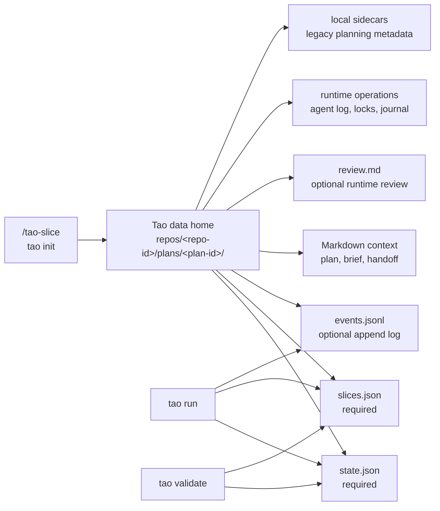
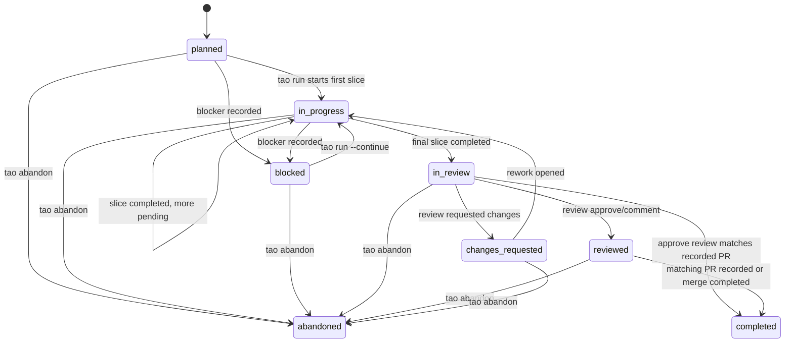
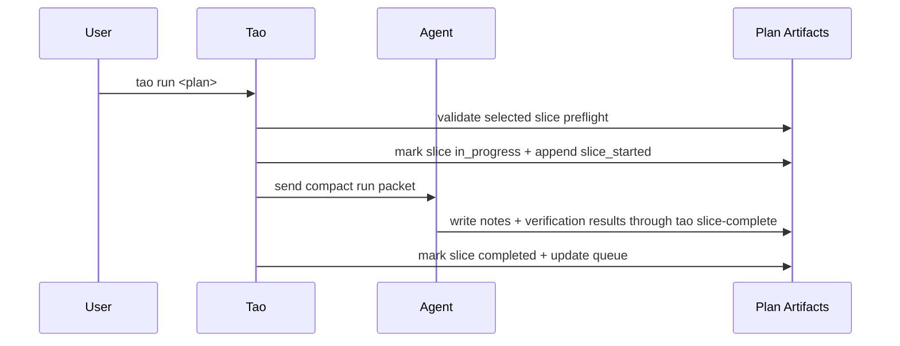

# Tao Plan Format

Tao plans are local execution artifacts for agent work. They preserve planning intent, divide work into serial slices, and record progress as slices run.

This document is the artifact contract for Tao contributors and advanced users. For command reference and day-to-day workflow judgment, use the project [`README.md`](../README.md) and [usage guide](usage-guide.md). Maintainers working on persistence and compatibility should follow the [mutation-journal protocol](plan-mutation-journal.md) and [typed clear-vs-preserve design](design/typed-clear-seam.md); those documents explain implementation mechanics while this page defines observable artifact behavior.



## Plan Directory

A plan directory is usually allocated by `/tao-slice` through:

```sh
tao init --slug <short-slug> --json
```

The command registers the current Git repository and returns `plan.dir` under Tao's data home. Tao uses the first non-empty location in this order:

1. `TAO_DATA_HOME`
2. `XDG_DATA_HOME/tao`
3. `HOME/.local/share/tao`

If none of those environment values is available, the final fallback is the relative path `./.local/share/tao`. The selected root contains repository-scoped plans:

```text
<data-home>/
└── repos/<repo-id>/plans/<plan-id>/
```

Normal CLI commands default to the current repository's plan scope. `tao repo list`, `tao repo show <repo-id>`, and `tao repo doctor` inspect the centralized repository registry without mutating repositories. Runtime commands can still read plans from `--plans-dir DIR` or from an explicit plan path when a caller intentionally opts out of the default scope.

Plan loaders validate plan-directory artifacts and must not depend on unrelated data-home sidecars for plan validity.

## File Contract

### Plan artifacts and context

| File | Loader requirement | New `/tao-slice` expectation | Purpose |
| --- | --- | --- | --- |
| `state.json` | Required | Required | Mutable plan lifecycle and queue state. |
| `slices.json` | Required | Required | Executable slice definitions and verification commands. |
| `events.jsonl` | Optional | Created | Append-only lifecycle and telemetry events. Invalid lines warn, not fail. |
| `plan.md` | Optional | Created | Human-readable goal, constraints, decisions, assumptions, risks, and slice overview. |
| `planning-brief.md` | Optional, warning if missing/malformed | Created | Fixed-section compact planning summary for future build agents. |
| `handoff.md` | Optional | Created | Concise future-agent context without duplicating Tao-owned run protocol. |
| `review.md` | Optional | Absent | Latest persisted human-readable agent review output. When present, it belongs to the same recoverable artifact mutation as the matching state and event changes. |

The `/tao-slice` expectation describes planning-agent output. `review.md` is not planning input: Tao owns the runtime-created copy of review output. Legacy planning-session sidecars are not part of the live contract. See [Legacy / backward-compatibility (read-only)](#legacy--backward-compatibility-read-only).

### Runtime operation files

These files are Tao-owned operational state, not agent-authored plan artifacts or extension points:

| File | Lifetime | Purpose |
| --- | --- | --- |
| `agent-run.log` | Created and appended by agent-backed runtime sessions | Captured session log read by `tao log`; it is diagnostic data, not lifecycle or recovery authority. |
| `.run.lock` | Present while a plan driver owns the plan; normally removed on release | Cross-process run ownership and contention metadata. |
| `.mutation.lock` | Created by journal-capable persistence and retained | Stable-inode advisory lock shared by journal writers and recovering readers. |
| `.mutation.json` | Present only while a journaled mutation needs settlement | Tao-owned roll-forward intent; absent after successful settlement. |

Operational logs and locks are not validated as plan content and never replace `state.json`, `slices.json`, or lifecycle events as durable workflow evidence.

### Recoverable artifact mutations

Tao-owned persistence may use `.mutation.json` to make a non-empty combination
of `state.json`, `slices.json`, optional `review.md`, and lifecycle events settle
as one roll-forward mutation. A valid pending journal is authoritative and is
settled before mutable artifact state is exposed. A malformed, mismatched, or
unsupported journal makes the plan unreadable; Tao does not guess, roll back, or
delete the intent.

The journal does not change required-artifact schemas, except that
transaction-owned events may carry `mutation_id`. Plans without a journal retain
the tolerant legacy load path, including historical torn state/slices
combinations and events without `mutation_id`. The journal is Tao-owned recovery
metadata, not an agent or consumer extension point. See
[Plan Mutation Journal](plan-mutation-journal.md) for payload preparation,
settlement order, replay, validation, and limitations.

## Context Markdown

### `planning-brief.md`

New plans should include a concise planning brief with these fixed headings:

- `User Goal`
- `Constraints`
- `Non-goals`
- `Expected Files/Packages`
- `Validation Strategy`
- `Open Questions`

Missing or malformed briefs are warning-only findings so existing plan directories remain compatible.

## State Lifecycle

Plan status values:

| Status | Meaning |
| --- | --- |
| `planned` | Plan exists but no slice is currently running. |
| `in_progress` | At least one slice has started or work remains after a completed slice. |
| `in_review` | All slices are complete and the plan is awaiting a successful review. |
| `reviewed` | Review completed without requested changes; an approved review may be merged or paired with matching PR metadata. |
| `changes_requested` | Review completed with requested changes; use `tao rework` or address manually. |
| `completed` | Tao's lifecycle is terminal through recorded merge evidence or a qualifying reviewed PR handoff. |
| `abandoned` | The unfinished plan was intentionally made terminal with a durable reason; this does not assert completion, approval, PR success, or merge integration. |
| `blocked` | Work cannot continue without a fix, decision, approval, or dependency. |

There are two current completion paths:

- The no-PR path records integration into the default branch and appends a current `plan_merged` event.
- The PR path requires a current review with status `completed` and verdict `approve`, plus recorded pull-request metadata whose head SHA exactly matches the review's same non-empty head. This is local workflow completion only: Tao does not query or assert the remote PR's merge, review, CI, open/closed, or draft state. Lifecycle readers apply this predicate too, so existing matching artifacts project `completed` without requiring a rewrite first.

`tao abandon --reason TEXT PLAN` transitions any non-completed lifecycle state to `abandoned`. It trims and bounds the required reason, serializes through the ordinary per-plan run lock, reloads under that lock, and refuses unsettled automatic slice-completion, workspace-rebase, single-merge, or pull-request transactions. Repeating the command is idempotent: the first `plan_abandoned` event remains authoritative for reason and timestamp. Abandonment preserves slices, reviews, prior events, telemetry, Git and workspace evidence, branches, and worktrees; cleanup remains an explicit preview-first operation.

Only a current `plan_merged` event in `events.jsonl` proves integration into the default branch; `status: completed` alone does not. A later `plan_reopened` supersedes earlier review, PR-completion, and merge evidence until the reworked head is reviewed and recorded again. Plans written by releases predating merge-event tracking may carry `status: completed` without modern merge or qualifying PR evidence. Status projection trusts that persisted legacy status rather than demoting historical plans to `in_review` on upgrade, and report projection retains its legacy merged-outcome inference for those records.

`state.json` owns repository context and the queue. New plans should record `repo.base_commit` as the Git commit that was current when the plan was sliced; `tao staleness PLAN` uses it to detect likely stale pending slices after later commits.

- `plan.change_type` records the planning-time Conventional Commit type for the whole plan. New plans require exactly one of `feat`, `fix`, `docs`, `style`, `refactor`, `perf`, `test`, `build`, `ci`, `chore`, or `revert`. Repository-facing category names map `feat` to `feature` and preserve every other supported type unchanged. Historical plans that omit the field remain readable and runnable; an invalid non-empty value produces a validation warning.
- `plan.decision` records the structured rationale for the planning recommendation. New plans require `problem`, `why_now`, `expected_benefit`, `readiness`, one or more `success_criteria`, `disposition`, `disposition_reason`, and the complete `priority` object. `readiness` is `ready`, `needs_refinement`, or `blocked`; `disposition` is `ready`, `conditional`, `deferred`, or `obsolete`. The prose fields and every criterion are non-empty and should state material uncertainty instead of inventing deadlines or business priority.
- `plan.decision.priority.level` is `must`, `should`, or `could`. The dimensional fields `impact` (benefit magnitude), `urgency` (time sensitivity), `risk` (downside), and `confidence` (confidence in the assessment) independently use `low`, `medium`, or `high`; `effort` (implementation size) is `small`, `medium`, or `large`. These values explain tradeoffs; Tao does not calculate an aggregate score.
- `plan.sequence` records a one-based `position` within a positive `total`. A standalone plan uses `1` of `1`. Optional relationships identify an exact plan in the same repository, use `before`, `after`, or `related`, and include a reason. Multi-plan slicing allocates every plan before writing positions and IDs; when one plan should run after another, it uses an `after` relationship to the already allocated ID.
- Decision and sequence metadata is advisory. It does not make work runnable, satisfy slice dependencies or approvals, bypass repository and lifecycle checks, authorize execution, or prove completion. Runtime commands continue to enforce their ordinary gates.
- Optional `plan.runtime_prerequisites` is a bounded list of strict execution dependencies. Each entry contains an exact `plan_id` from the same repository and a non-empty `reason`; self-references, duplicate targets, malformed entries, and resolvable cycles produce validation warnings. A prerequisite is satisfied only when the referenced plan has durable Tao merge evidence and that merge is an ancestor of the selected execution baseline. Sequence order and relationships never create or satisfy a runtime prerequisite.
- Historical plans may omit decision, sequence, and runtime-prerequisite metadata. They remain readable and valid, and overview projection may use bounded `planning-brief.md` or `plan.md` prose without inferring categorical priority or disposition; consumers must present that fallback as unranked. If an optional block is present but malformed, ordinary plan validation emits warnings rather than invalidating the plan. The new-plan generation path is stricter and rejects missing or malformed required decision metadata before accepting a newly allocated plan.
- `plan.current_slice` is the selected slice while work is active.
- `plan.pending_slices` is ordered and drives the next runnable slice.
- `plan.completed_slices` records completed slice IDs.
- `plan.last_run_commit_policy` records the effective commit policy (`slice` or `none`) from the latest run start. The historical value `plan` remains readable, but new run, prompt, environment, and queue inputs reject it with migration guidance. Missing values and legacy `run_context` fallback remain supported.
- `plan.last_run_starting_dirty` records the Git paths dirty at the latest run start; automatic `slice` starts store an empty list because they require a clean execution tree, while legacy and manual-policy records remain readable.
- Optional `plan.final_verification` records the repository-wide pre-review gate with `command`, absolute `cwd`, `result`, optional `details`, optional `failure_kind`, optional `exit_code`, and `verified_at`. `failure_kind`, when present, is `code`, `tool_missing`, `timeout`, `cancelled`, or `invalid_command`; `exit_code` is the observed process exit code when one is available. Omitting either field remains valid for historical and new artifacts, and each fresh evidence write clears either field it omits rather than preserving stale failure classification. When no repository-owned command is detected, Tao still records `result: skipped` without failure fields rather than inventing a command. A current failed result bound to the exact completed workspace head is projected to consumers as `verification_failed`; this projection never changes the persisted `state.json` status.
- Optional `plan.review.commit_message` is the untrusted proposal produced by the reviewer of the exact recorded `base..head` diff. It has `subject` and `body` strings; the subject is `<type>(<lowercase-scope>): <lowercase-imperative-summary>`, and the body has non-empty canonical `What:` and `Why:` sections. It must not contain `Tao-*` trailers. New `approve` reviews require a valid proposal; a missing, malformed, oversized, or reserved-trailer proposal downgrades the parsed result to bounded `comment` rather than persisting approval. `changes_requested` and `comment` reviews store `commit_message: null`, explicitly clearing a stale approved proposal. Historical reviews without this field remain readable. Pull-request finalization may replace an unusable historical approval proposal after one proposal-only correction, while preserving its exact review base/head and substantive findings.
- Optional `plan.finalization_failure` records a bounded post-review failure. `phase` is `proposal_repair` with `review_base` and `review_head`, or `pull_request_finalization` with `branch` and `head_sha`; both forms also carry a machine `category`, UTC `failed_at`, and machine `recovery_action`. The two boundary shapes are mutually exclusive. This evidence drives recovery presentation but grants no authority: live Git plus current review, workspace, intent, and remote identity checks remain required. A matching successful review replacement, PR recording, merge, or reopen clears obsolete evidence; historical plans may omit it.
- Optional `plan.merge_commit_intent` binds `message`, `plan_id`, `source_head`, `default_branch`, `default_parent`, and `created_at` before a single squash mutates Git. `message` is the exact final validated review (or exceptional generated) proposal plus Tao-owned evidence. Matching retries reuse it without another agent call. Historical intents remain exact recovery authority and are not reformatted. For a default squash conflict it may contain an optional `resolution` object. Resolution phases are `requested`, `resolved`, `committed`, `reviewed`, and `rolled_back`; the object durably carries `conflict_files`, `requested_at`, `outcome`, bounded `summary`, exact `changed_paths`, `content_fingerprint`, exact `commit_message`, `resolved_at`, `integration_head`, `committed_at`, an optional independent `review`, and bounded `rollback_reason`/`rolled_back_at` settlement evidence. The review projection has `status`, `verdict`, bounded `summary` and `findings`, exact `base`/`head`, bounded `agent`, and `reviewed_at`; it does not replace the source plan's `review.md` or `plan.review`. Fields not yet reached are present as their zero values after the optional resolution object is created, and plans without resolution evidence retain their legacy meaning.
- Single-squash recovery is phase- and boundary-specific. Before writing `requested`, Tao validates the provider configuration and OS filesystem-confinement prerequisite; a preflight failure starts no provider, writes no resolution phase, and restores the prepared squash so a later invocation can retry. Once written, `requested` is deliberately not replayed because provider completion is uncertain. `resolved` can settle only when the unstaged path set and content fingerprint match the durable proposal at the recorded default parent. `committed` can recover only the exact Tao-created commit with the recorded parent, full message, source ref, default ref, clean worktree, and integration head. `reviewed` authorizes completion only for a completed `approve` bound to that same parent/head; every other verdict is terminal non-authorization. After verification failure or review non-approval, successful exact-parent restoration advances to `rolled_back` and appends durable diagnostic evidence; that inactive phase permits clearing, source-review replacement, rework reopening, and a fresh intent for a changed source. Drift, ambiguous dirt, protected-ref movement, or incomplete evidence is a refusal, not a new baseline. Neither `--force`, telemetry, nor provider output weakens these predicates; rollback moves default only while the exact recorded boundary still matches.
- A worktree is actively Tao-managed only when canonical repository identity, exact physical `workspace.path`, recorded `workspace.branch`, and non-cleaned workspace metadata all match. Standalone commit context and finalization use this durable ownership tuple rather than branch-name conventions; multiple exact active claims are ambiguous and fail closed. Their recovery hint recommends blocked restart only when the current blocked slice records a complete isolated automatic pre-intent `execution_start` and execution root. Ordinary blockers use continuation, while manual/current-checkout or post-intent boundaries use slice-completion recovery; live Git and baseline checks remain authoritative in the run path. Control checkouts, unrelated worktrees, stale paths, and workspaces with `cleanup_status: done` or lifecycle `cleaned` are not claimed.
- Optional `workspace.rebase_intent` is written before a workspace rebase mutates Git. It binds the workspace `branch`, `base_branch`, `old_head_sha`, `old_base_sha`, `new_base_sha`, ordered `commit_count`, versioned `commit_series_fingerprint`, and UTC `created_at`. The fingerprint proves the exact linear `old_base_sha..old_head_sha` feature series from rebase-stable commit metadata, messages, and content changes; ancestry alone is not proof. Current writers use `v5`, whose proof remains stable across a conflict-free upstream rename but rejects ambiguous or displaced edits. Historical `v1`–`v4` intents remain readable but cannot satisfy a newly computed `v5` recovery proof. Plans without this field remain readable.

An ordinary update that omits `workspace.rebase_intent` preserves an existing
intent. Exact clear or successful settlement writes `"rebase_intent": null`
while preserving unknown workspace fields; settlement records the new base,
HEAD, and workspace status in the same artifact mutation. Exact retries are
idempotent, while conflicting replacement, mismatched clearing or settlement,
and an intervening branch or HEAD change are refused. The
[typed clear-vs-preserve design](design/typed-clear-seam.md) describes the writer
seam, and the [mutation-journal protocol](plan-mutation-journal.md) describes
atomic settlement and replay.



First-class plan edits mutate only pending work:

- `tao edit remove PLAN SLICE` removes a pending slice from `slices.json` and `plan.pending_slices`.
- `tao edit skip PLAN SLICE` removes a pending slice from `plan.pending_slices` and keeps its slice record with status `skipped`.
- `tao edit move PLAN SLICE --before ID` and `--after ID` reorder only `plan.pending_slices`.

Edit mutations must reject completed, in-progress, blocked, missing, or dependency-invalid slices and keep `state.json` and `slices.json` consistent.

When an opt-in full run successfully creates or discovers a GitHub pull request, `state.json` may include `plan.pull_request` with the PR `number`, `url`, `created_at`, source `branch`, and exact `head_sha`. This metadata is durable so renderers can show a stable PR link after restart and compare the recorded head with the current approved review. Missing or mismatched heads remain readable but do not qualify for PR completion. If `gh pr create` emits an exact PR identity before required metadata application fails, `plan.pull_request_intent` stores that number, URL, branch, and exact head before Tao attempts repair, so later retries mutate only that identified PR; successful PR recording clears the intent. Legacy branch/head-only intents remain readable but are not ownership evidence and never authorize metadata repair on a discovered PR.

## Slice Lifecycle

Slice status values mirror plan status where useful:

| Status | Meaning |
| --- | --- |
| `pending` | Waiting to run. |
| `in_progress` | Selected and started by Tao. |
| `completed` | Finished and verified. |
| `blocked` | Cannot continue without outside action. |
| `skipped` | Intentionally removed from the pending queue while retained for audit. |

Each slice should include:

- A stable `id`, such as `001-short-name`.
- A short `title`, `goal`, and implementation `tasks`.
- `depends_on` for serial dependencies.
- Optional `tags`.
- `expected_files` to describe the intended scope for planning and commit warnings.
- Optional `required_inputs` for concrete repository artifacts that must exist before implementation begins; legacy slices and slices with no prerequisites omit it.
- Optional `execution_root`, recorded by `tao run` at slice start as the absolute checkout or worktree root used for that run; legacy slices may omit it.
- Optional `execution_start`, recording the immutable prepared boundary for an automatic slice. `branch` and `head` identify the original Git boundary; `commit_policy` and `workspace_strategy` preserve the effective execution choices (`slice` plus `worktree` for a resumable isolated run). Legacy records may omit the latter fields, which Tao infers only from durable plan/workspace metadata.
- Optional `commit_intent` written before Git mutation. It contains the completion-input `hash`, `policy`, optional `starting_branch`, `starting_head`, exact final `message`, and `created_at`. For new automatic intents, the hash binds the completion report and message together.
- Optional `completion` with `outcome` and optional `commit_sha`. Outcomes are `committed`, `no_changes`, and `manual_uncommitted`.
- `verification.commands`: every slice must include at least one deterministic verification command; select commands from repository-owned guidance where possible. For docs/config/asset-only slices where no build/test command applies, use a deterministic fallback such as `grep -q`, `test -f`, or `git diff --stat`.

### Required inputs

`required_inputs` is an optional array of filesystem prerequisites. Each entry has:

```json
{
  "path": "generated/schema.json",
  "kind": "file",
  "reason": "The generator output defines the schema consumed by this slice."
}
```

`path` must be a concrete repository-relative path: absolute paths, parent traversal, wildcards, trailing-slash placeholders, and vague paths are invalid. `kind` is exactly `file` or `directory`, and `reason` must be non-blank. Omit the field when the slice needs no repository artifact before work begins; plans that predate this field remain readable and runnable without migration.

During whole-plan validation, a missing input is allowed as a warning only when a slice named directly in the consumer's `depends_on` declares the exact normalized path in its `expected_files`. Serial order, transitive dependencies, prefixes, wildcards, and near matches do not establish a producer contract. At selected-slice preflight, the artifact must actually exist with the declared kind in the prepared execution worktree. A producer declaration does not waive that runtime check.

These commit fields are optional for backward compatibility: plans completed
before transactional slice commits load without them. Under policy `slice`, a
new intent requires a bounded proposal from the active implementation agent.
Tao centrally validates the supported type, lowercase scope and imperative
summary (at most 72 characters), and non-empty `what`/`why`; it then formats
canonical `What:`/`Why:` sections and appends exact `Tao-Plan: <plan-id>` and
`Tao-Slice: <slice-id>` trailers. Proposal-supplied `Tao-*` lines are invalid.
Invalid content stops before intent, staging, or commit and may be repaired in
the same session; there is no deterministic or title fallback.

The exact final formatted message is stored in `commit_intent.message` and is
part of the new intent hash. A modifying completion records `committed` and its
SHA; no diff records `no_changes` without creating an empty commit (the boundary
HEAD may be retained as `commit_sha`). Policy `none` records
`manual_uncommitted` and does not mutate Git. On retry, Tao may recover an
already-created commit only when HEAD's parent is the intent's `starting_head`
and the full commit message, including trailers, matches the intent.

Legacy intents whose hash predates message binding retain their recorded message
verbatim and settle through the historical commit path; they are never
revalidated, rewritten, or upgraded in place. This compatibility is recovery,
not a fallback for a new proposal.

> **Upgrade warning:** if Tao is upgraded while an automatic commit transaction
> already has `commit_intent`, that active transaction keeps its historical
> message contract until it settles. The stronger proposal contract begins at
> the next pre-intent transaction; do not delete intent or restart an agent to
> force an in-flight transaction onto the new format.



Approval-gated work uses an `approval` object. A runner must stop before implementation when approval is required but not granted. `tao approve [--slice ID] [--by NAME] <plan>` sets `approval.approved`, `approval.approved_by`, and `approval.approved_at`, preserves existing approval metadata on repeated approval, and does not execute work.

`tao run` owns deterministic start bookkeeping after selected-slice preflight passes and before invoking the agent: it sets the plan and selected slice to `in_progress`, updates start and last-activity timestamps, records `plan.current_slice`, and appends one `slice_started` event per slice attempt sequence. Agents should not duplicate this metadata during normal runs.

An interrupted in-progress automatic slice is classified from durable slice/workspace fields and live Git state before Tao prepares or mutates a workspace. An isolated pre-intent slice may resume in its recorded worktree only when the execution root, branch, HEAD, clean-start metadata, policy, and strategy still match and no conflict or Git operation is active. Tao preserves staged, tracked, and untracked paths; it never moves the recorded boundary. A clean start whose lifecycle write was torn before `execution_start` may be repaired from matching prepared workspace metadata. Dirt without that immutable boundary is not attributable and is refused. Current-checkout or policy-`none` work remains manually owned rather than being auto-resumed.

Resume attempts do not append another `slice_started` event. Each agent handoff appends `slice_resume_attempted` with its numbered `attempts` value; a failed handoff best-effort appends `slice_resume_failed` with the same attempt number and failure reason. These events are audit history, not recovery evidence: provider errors, metrics, and event availability never authorize a retry or redefine the execution boundary.

Within one implementation-slice invocation, Tao may automatically attempt at most two resumes after explicitly structured retryable transport failures, using fixed context-cancellable delays of 1 second and 2 seconds. Each attempt reloads artifacts, repeats selected-slice verification preflight, and must satisfy the same durable execution-boundary checks described above before a fresh provider session starts. The budget is invocation-local and is independent of durable resume-attempt numbering. A durably completed slice is accepted after ordinary progress and completion-boundary validation without another handoff. This changes no event or artifact schema and adds no retry configuration.

The supported runtimes are `pi` and `claude`. Of those, only Pi currently exposes the retryable structured source, its `provider_transport_failure` diagnostic. Matching text, generic and authentication errors, session timeouts, planning, review, pull-request, and merge sessions, and manual, policy-`none`, unsafe, or post-`commit_intent` states do not retry. In particular, neither a provider error nor an `agent_metrics`, `slice_resume_attempted`, or `slice_resume_failed` event is authorization; the durable execution facts and live Git boundary remain the sole recovery authority.

Normal `tao run` rejects blocked plans and blocked selected slices. `tao run --continue` is only for cases where the blocker has already been cleared manually; it clears Tao's blocked lifecycle state and restarts `plan.current_slice`, or falls back to the first pending slice only when the plan or that slice is blocked. Continue mode must not bypass approval gates, dependencies, completed-plan checks, missing-slice checks, branch or commit safeguards, or selected-slice verification preflight.

`tao slice-complete --plan-dir DIR --slice-id ID --notes-file FILE --verification-results-file FILE [--commit-proposal-file FILE]` owns deterministic completion bookkeeping after verification passes. A new automatic slice intent requires the structured proposal file; Tao validates it and persists the exact trusted final message before staging. Existing intents settle from durable state and do not require or authorize a fresh proposal session. Tao creates or recovers the commit, persists `completion`, then marks the slice completed and moves the queue. Policy `none` skips Git and records `manual_uncommitted`. State, timing, notes, verification results, and at most one `slice_completed` event are written only after the transaction outcome is known.

Recovery is split at `commit_intent`. Before intent, only an exact isolated automatic boundary can return to the implementation agent. Once `commit_intent` or `completion` exists, Tao does not start an agent: the original `tao slice-complete` inputs must settle or recover that transaction. Changed branch/HEAD boundaries, active Git operations, conflicts, ambiguous status, and unrelated dirt without a boundary are refusal states, not alternate baselines. Direct and queued execution apply the same classification under a cross-process plan lock.

## ID Resolution

New plan IDs are generated in UTC as `YYYYMMDD-HHMMSS-slug`. Plans allocated in the same second may share the timestamp and are distinguished by their slug; an identical timestamp and slug retains the numeric collision suffix. Legacy minute-level `YYYYMMDD-HHMM-slug` IDs remain supported without renaming or migration.

CLI commands accept exact plan IDs, unique ID prefixes, and unique slug or slug-prefix aliases for both shapes. Ambiguous prefixes are errors.

`tao run` also accepts a filesystem path to a plan directory or a file inside one.

## Validation

Plan loading should validate consistency without making list views brittle:

- `state.json` and `slices.json` are required.
- `events.jsonl` is optional.
- Invalid plan directories are surfaced as warning summaries in list output.
- Malformed event lines are preserved as warnings while valid events still load.
- Completed plans should have no current slice and no pending slices.
- `plan.pending_slices` should contain each queued ID at most once and should otherwise reference pending slices only. The one narrow exception is the entry matching `plan.current_slice`, which remains queued while that slice is `in_progress` or `blocked`; a blocked current slice missing from a non-empty pending queue is inconsistent.
- `plan.completed_slices` should reference completed slices only; skipped slices stay out of both pending and completed queues.

Input-readiness errors are limited to malformed plan structure and explicit `required_inputs` facts. Whole-plan validation checks every declaration and permits only the exact direct-producer warning described above. Run preflight checks only the selected runnable slice against its prepared execution worktree; missing, unavailable, or wrong-kind declared inputs block before lifecycle mutation or agent handoff.

Verification-command semantic analysis is additive and advisory. A missing or entirely blank `verification.commands` list is malformed slice structure and blocks, but findings about command working directories, arguments, package context, or referenced files remain warnings. Tao does not execute verification commands during readiness and does not treat supported analyzer patterns as proof that it understands arbitrary command semantics.

Queued runs must pass repository health checks against the plan's recorded `state.repo.root`. Missing roots, non-Git roots, and metadata errors block execution while remaining visible in CLI repository views.

Command analysis is intentionally conservative and covers common documented forms only, including:

- `cd DIR && COMMAND`
- `pnpm --dir DIR ...`
- `pnpm --filter PACKAGE ...`
- direct `go test`
- direct Vitest or Jest-style file arguments

Commands that execute from a package cwd should use package-relative test paths. For example, prefer:

```sh
pnpm --filter api exec vitest src/user.test.ts
```

over:

```sh
pnpm --filter api exec vitest services/api/src/user.test.ts
```

when `services/api` is the package cwd.

When a listed verification command is invalid but a mechanically equivalent corrected command succeeds, slice metadata should preserve both command results so invalid command setup is distinguishable from code or test failure.

## Clearable fields and the merge-write contract

Tao deep-merges state and slice updates over the stored JSON so unknown fields
survive. Intentional clears are serialized explicitly as `null`, `""`, or `[]`;
omitting a preserve-by-default field does not erase its stored value. Consumers
must therefore treat an explicit empty representation as a clear and must not
infer a clear from a field being absent in an update.

### Known clearable fields

| Field | JSON key | Stored clear and compatibility behavior |
| --- | --- | --- |
| `State.Plan.CurrentSlice` | `current_slice` | `null`; an ordinary omitted/nil value preserves the stored selection. |
| `PlanState.LastRunCommitPolicy` | `last_run_commit_policy` | `""`; review then uses legacy event fallback or `none`. |
| `PlanState.LastRunStartingDirty` | `last_run_starting_dirty` | `[]`; removes stale dirty-path tolerance after a clean run start. |
| `PlanState.Review` and known `PlanReview` fields | `review` | Replacing the object emits every known field, including `findings: []` and `commit_message: null`, while preserving unknown keys. Clearing the whole block stores `null`. An ordinary omitted value preserves the stored review. |
| `PlanState.PullRequestIntent` | `pull_request_intent` | `null`; removes partial PR-creation recovery evidence after successful recording. |
| `PlanState.MergeCommitIntent` | `merge_commit_intent` | `null`; guarded settlement or supersession removes single-merge recovery evidence. |
| `Workspace.DependencyFailure` | `dependency_preparation_failure` | `""`; an ordinary omitted/empty value preserves the stored failure. |
| `Workspace.DependencyFingerprint` | `dependency_fingerprint` | `""`; an ordinary omitted/empty value preserves stored evidence. |
| `Workspace.RebaseIntent` | `rebase_intent` | `null`; only exact clear or settlement removes the stored rebase boundary. |
| `Slice.BlockerNote` | `blocker_note` | `""`; an ordinary omitted/empty value preserves the stored blocker note. |
| `Slice.ExecutionRoot` and `Slice.ExecutionStart` | `execution_root`, `execution_start` | A blocked restart superseding an exact pre-intent boundary stores `""` and `null`, respectively. Ordinary omitted/empty or omitted/nil values preserve the stored boundary; directly zeroing the typed fields without the blocked-restart clear intent has that preserve-on-omission result rather than clearing them. |

Other preserve-by-default fields include the `State.Workspace` pointer and its
non-clearable sub-fields, `Repo.BaseCommit`, `PlanState.ChangeType`,
`PlanState.PullRequest`, and slice `Tags`, `Approval`, `Notes`, and
`VerificationResults`. Their zero values do not clear previously stored values.
Historical artifacts using the explicit representations above remain
schema-compatible and readable.

See [Typed clear-vs-preserve persistence seam](design/typed-clear-seam.md) for
the field-specific validation limits, Go lowering seam, preserve-on-omission
behavior, and typed-writer test coverage.

## Legacy / backward-compatibility (read-only)

New plans never create these; documented only so old plan directories still load.

Planning-session capture is no longer supported. If optional legacy planning-session sidecars are present in a local plan directory, loaders may display them as best-effort audit metadata, but missing sidecars must not warn, fail validation, or block execution. These files are local-only metadata, and the built-in `pi` and `claude` runtimes do not write transcript or session sidecars.

| File | Purpose |
| --- | --- |
| `planning-session.json` | Legacy local planning-session export. Tao tracks its presence and path but does not decode it into core plan models. |
| `planning-session-stats.json` | Legacy Tao-owned planning-session summary, including planning agent when known, session ID, repository root, timestamps, provider/model, usage, cost, and stale-metadata status. |
| `planning-prompt.md` | Legacy extracted planning prompt text used to create the plan. |

`agent` records the planning runtime when known: `pi` or `claude`. It is audit metadata only; plans remain portable and may be run by either supported agent runtime later. `planning_started_at` records when the `/tao-slice` prompt began. It intentionally lives in `planning-session-stats.json`, not core `state.json` timing. Renderers should round positive canonical planning duration to the nearest second and prefer positive `planning_started_at` duration.

If sidecar metadata appears stale or mismatched, stats should set `capture_suspect` and `capture_suspect_reason`. Stale sidecars must hide all planning metrics, including duration, tokens, messages, cost, model, and tool-call data.

## Telemetry Warnings

Agent budget warnings are informational summaries derived from `agent_metrics` events. Slice and whole-plan totals have separate defaults:

| Metric | Slice threshold | Plan threshold |
| --- | ---: | ---: |
| Output tokens | `40000` | `150000` |
| Cost | `5` | `20` |
| Tool calls | `120` | `400` |
| Assistant messages | `80` | `300` |
| Errored messages | `0` (warn on any) | `0` (warn on any) |

These thresholds apply to output tokens, not total tokens. Corresponding `TAO_BUDGET_SLICE_<METRIC>` and `TAO_BUDGET_PLAN_<METRIC>` variables can override each advisory value, where `<METRIC>` is `OUTPUT_TOKENS`, `COST`, `TOOL_CALLS`, `ASSISTANT_MESSAGES`, or `ERRORED_MESSAGES`. Invalid advisory overrides retain the built-in value.

The opt-in hard caps `TAO_MAX_SLICE_OUTPUT_TOKENS` and `TAO_MAX_SLICE_COST` are separate and disabled by default. A crossed hard cap can stop a slice and emit `budget_exceeded`; advisory threshold warnings never change plan lifecycle state or block execution. Renderers should show the metric, threshold, observed value, and slice ID when applicable.

Run-context telemetry is recorded as `run_context` events before each agent slice attempt. It records whether a compact run packet was rendered and how many warning-level selected-slice guardrail findings were present. This supports prompt-efficiency analysis, but missing telemetry must not invalidate plans or block runs.

## Events

`events.jsonl` records append-only lifecycle and telemetry events. Event types are additive: the table describes current well-known entries, not a closed enum, and readers retain tolerance for historical or newer event types.

Current well-known event types include:

| Event type | Purpose |
| --- | --- |
| `plan_created` | Initial event written by `/tao-slice`; may include `agent` for the planning runtime. |
| `plan_abandoned` | First authoritative abandonment timestamp and bounded reason recorded by `tao abandon`; it does not prove completion or integration. |
| `slice_started` | Selected slice attempt started. |
| `slice_completed` | Slice completion transaction settled successfully; detailed intent, outcome, and SHA live in `slices.json`. |
| `slice_blocked` | The selected slice and plan were marked blocked with the persisted reason. |
| `slice_resume_attempted` | Agent handoff for an interrupted automatic slice was attempted. |
| `slice_resume_failed` | Agent handoff for an interrupted automatic slice failed. |
| `slice_restarted` | A blocked pre-intent slice was reset to pending after its baseline advanced; records the slice ID, prior execution root/branch/head, fresh baseline branch/head, and restart reason. |
| `slice_removed` | Pending slice removed by `tao edit remove`. |
| `slice_skipped` | Pending slice skipped by `tao edit skip`. |
| `slices_reordered` | Pending queue reordered by `tao edit move`. |
| `slice_approved` | Approval-gated slice was approved. |
| `pull_request_created` | Pull request created or discovered and its exact source head recorded after run finalization. |
| `finalization_failed` | Bounded proposal-repair or pull-request-finalization failure evidence was recorded for an exact boundary. |
| `finalization_failure_cleared` | The exact previously recorded finalization failure was explicitly superseded. |
| `pr_feedback_triaged` | A validated classification snapshot for the current pull-request review-thread set was persisted. |
| `plan_reviewed` | Plan review result was persisted. |
| `plan_reopened` | Plan reopened for rework. |
| `plan_merged` | Plan merged into the default branch. |
| `verification_command_invalid` | Verification command failed before tests loaded. |
| `run_context` | Pre-attempt run-packet and guardrail telemetry. |
| `session_timeout` | Agent session exceeded its wall-clock timeout. |
| `budget_exceeded` | An opt-in hard slice output-token or cost cap was crossed; records the metric, threshold, and observed value. |
| `rework_round` | Authoritative evidence that an automatic rework round was atomically reopened. |
| `rework_stopped` | Authoritative evidence that automatic rework stopped at a persisted safety bound. |
| `final_verification` | Final repository verification result was recorded, including optional `failure_kind` and `exit_code`. |
| `verification_repair_created` | A bounded repair slice was generated for the current failed final verification; records the generated slice ID, failed command and fingerprint, and the failed head in `reason`. |
| `merge_verification` | Merge verification result was recorded. |
| `single_merge_resolution_rolled_back` | An exact committed or reviewed single-plan conflict resolution was restored to its durable default parent; retains the bounded rollback reason and resolution/review diagnostics after the inactive intent is superseded. |
| `plan_commit_fallback` | Historical/read-only signal that plan-level commit generation fell back to the selected agent; retained for compatible loading and insights, with no current producer. |
| `plan_commit_guard` | Historical/read-only signal recording the plan-level leftover commit guard result; retained for compatible loading and insights, with no current producer. |
| `agent_metrics` | Agent metrics from run attempts when available. |

Legacy planning-session audit events may also appear in older local plans.

A recurring-file `rework_stopped` event is written before another reopen when a
normalized primary finding file appears in three consecutive
`changes_requested` reviews after the current rework baseline. Its `reason`
begins `automatic rework stalled on files recurring across three consecutive reviews: `
and ends with a sorted JSON string array of the recurring paths. `round` and
`attempts` describe rounds already created; the stop does not reopen the plan or
append slices. Attempt-cap and exact-fingerprint stops retain precedence, and
the plan remains `changes_requested` with its latest review intact.

Direct and queued rework use the same policy. A successful automatic round
atomically records `plan_reopened`, `rework_round`, state, and generated slices.
Once a stop is persisted, retries do not append another observation, and later
runs require explicit `--rework-restart` to establish a fresh baseline and
bounded window while retaining historical slices and ordinary gates.

This adds no event type or artifact field. Historical generated rework slices
without matching `rework_round` events remain readable round-count evidence and
are not migrated.
Legacy evidence that is missing, unsafe, associated-only, or incomplete never
authorizes a retroactive recurring-file stop; existing cap and
equivalent-finding records also remain readable. Reconstruction and interrupted
settlement mechanics live in [Plan Mutation Journal](plan-mutation-journal.md).

A `plan_abandoned` event records the required trimmed `reason` and UTC `timestamp`. The first such event is authoritative; retries do not append or replace it. The event and `status: abandoned` make the plan terminal and non-runnable while preserving unfinished slice state and all historical evidence.

A `slice_approved` event records the approved slice ID and timestamp. It is appended at most once per slice; repeated approvals are idempotent and preserve the original `approved_by` and `approved_at` metadata.

For automatic commits, `slice_started` precedes the durable `commit_intent` in
`slices.json`, and `slice_completed` is appended only after the Git outcome and
lifecycle mutation settle. There is no separate commit-intent event: retry state
must be read from the slice artifact, while the event remains the append-only
completion boundary.

Edit events record first-class `tao edit` mutations. Detailed historical slice content belongs in `slices.json`, not duplicated in event payloads.

A `pull_request_created` event includes the usual event fields plus `pull_request` with the same `number`, `url`, `created_at`, `branch`, and `head_sha` fields recorded in `state.json`.

A `finalization_failed` event includes `finalization_failure` with the same bounded phase, category, exact review or branch/head boundary, timestamp, and recovery action recorded in `state.json`. A `finalization_failure_cleared` event carries the exact superseded value. These events are audit evidence only and never authorize proposal correction, push, forge mutation, or lifecycle completion.

A `verification_command_invalid` event should include the original `command`, a concise `reason`, and, when a mechanically equivalent command is used successfully, `corrected_command`.

An `agent_metrics` event includes the usual event fields plus a top-level `agent` and a `metrics` object. The metrics object records the agent name, session ID, provider and model IDs when available, token counts, cost, assistant message count, tool call count, and run result/status so failed attempts can still be represented in telemetry totals. Metrics are generic across built-in runtimes; consumers should not assume runtime-specific fields.

Metrics events are durable plan artifacts, but collection is best-effort. Resolver and independent-reviewer metrics from a single-plan squash conflict use this same generic plan event with operation-specific messages. They are never written as merge-batch events. Repository-scoped `merge --all` telemetry instead lives in the batch store's `agent-events.jsonl` and is never copied into plan events or batch state. Missing metrics or persistence failures in either channel may warn but must not change an operation's outcome; neither telemetry channel authorizes merge, completion, or recovery.

A `run_context` event includes the usual event fields plus `agent`, `run_packet_provided`, and `guardrail_warnings`. It should be emitted after selected-slice preflight and before invoking the agent.

## Local-Only Data

Tao data-home contents and workspace-local `.tao/` metadata are always local-only. Never commit plan artifacts, notes, runtime operation files, or planning-session sidecars. A task may explicitly require Tao commands to update local plan state, but that does not make those files repository content.
